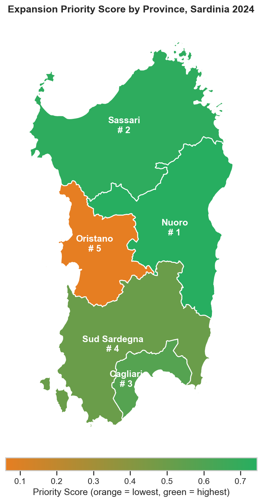

# Sardinia Hospitality Intelligence <a href="#"></a> <a href="it/README.md"></a>


[](https://codecov.io/gh/aleattene/sardinia-hospitality-intelligence)


> Seven years of data, five provinces:
> - where demand presses on supply,
> - where to expand first.

---

An end-to-end **Data Analysis** project that maps tourism demand and accommodation
supply across the Sardinian provinces on ISTAT-sourced open data, identifying
geographic and seasonal gaps to support data-driven expansion decisions in the
hospitality sector.

---

<br/>

## The three steps of the analysis

1. **Demand size**: how much each provincial market is worth and how it breathes
   through the year. *Who are the tourists? What is the seasonal profile?*
2. **Supply-demand gap**: where accommodation capacity fails to keep pace with
   arrivals, measured with a per-province occupancy proxy. *Where is the imbalance widest?*
3. **Direction**: where occupancy pressure, growth and international openness point
   together, summarised in a composite priority score. *Which segments are growing
   fastest? Where should operators expand first?*

The notebook ([`01_eda_demand_supply.ipynb`](notebooks/01_eda_demand_supply.ipynb))
walks the three steps at EDA depth.

The roadmap deepens the third step: statistical analysis and demand forecasting on the
portal's most recent years.

---

<br/>

## Key Findings

> *Based on 2018-2024 data across the five Sardinian provinces. The refresh with the
> 2025 vintage is planned for autumn 2026, the one with 2026 for the first quarter of
> 2027.*

### Demand recovery

Sardinia absorbed a collapse of roughly 56% of arrivals in 2020, rebounded strongly
through 2021-2022, and by 2024 reached **around 4.44 million arrivals**: roughly
**25% above 2019 pre-pandemic levels** (the province of Sassari alone accounts for
2.15 million arrivals, almost half the regional total).

### Supply-demand gap

All provinces remain far from saturation, because demand compresses into the summer,
but relative pressure is uneven.
**Nuoro** shows the tightest supply constraint (**15.2% occupancy proxy**, that is 55
nights sold per bed per year), followed by **Cagliari** (14.1%) and **Sud Sardegna** (13.5%).
**Oristano** closes the ranking (11.8%): available capacity but weak demand pull.

### Seasonality

Tourism is strongly concentrated in summer.
The top 3 months account for **52-66% of annual overnight stays** depending on the province.
**Cagliari is the least seasonal**: its peak month holds 20% of annual overnight
stays, the highest potential for year-round strategies.
The seasonality index summarises this concentration on a scale from 0.08 (stays spread
evenly across all months) to 1 (all stays in a single month): 0.13 for Cagliari
against around 0.19 for **Sud Sardegna** and **Nuoro**, the most concentrated.

### Tourist origin

International tourists represent a significant share everywhere, from **41% (Sud Sardegna)**
to **59.5% (Sassari)**.
**Sassari** and **Nuoro** attract the most internationally diverse demand: an asset for
premium positioning.

### Fastest-growing segments

**Short-term rentals are the dominant growth engine** across all provinces. YoY 2023-2024:
- +38.7% **Sassari**
- +32.5% **Nuoro**
- +31.1% **Sud Sardegna**

Hotels grew more modestly (+3-13%), with **Oristano** hotels contracting (-6.3%).

### Expansion priority

The composite priority score is the average of three levers, each normalized on a 0-1
scale against the other provinces: occupancy pressure, YoY growth and international
share. A score of 1 would mean being the best province on all three levers, a score of
0 the worst on all of them. The resulting ranking:

| Rank | Province | Priority Score |
|------|----------|----------------|
| 1 | Nuoro | 0.74 |
| 2 | Sassari | 0.72 |
| 3 | Cagliari | 0.58 |
| 4 | Sud Sardegna | 0.50 |
| 5 | Oristano | 0.06 |

Reading the ranking:
- **Nuoro** leads on occupancy pressure and international share
- **Sassari** stands out for growth momentum and international openness
- **Oristano** ranks last or nearly last on every lever, hence the near-zero score

---

<br/>

## Key figures

<br/>



<br/>


<br/>


<br/>

The full analytical path, figure by figure, is in the [EDA notebook](notebooks/01_eda_demand_supply.ipynb).

The commented findings, with operational recommendations, are in the [executive report](reports/REPORT.md).

---

<br/>

## Dashboard

An interactive dashboard built with **Looker Studio** provides a live, filterable view
of all key metrics.

**[Open the dashboard](https://lookerstudio.google.com/s/v2XX9XVY8Zk)**

#### Data flow: from pipeline to dashboard

```text
DuckDB (analytical DB)
  └── step_03_export.py
        ├── CSV files (local, always)
        └── Google Sheets (opt-in, on explicit request)
              └── Looker Studio (live connector, auto-refresh)
```

The pipeline exports the analytical tables to CSV by default.

When `PUSH_TO_SHEETS=true` is explicitly set, the same data is also pushed to Google
Sheets, which Looker Studio reads as a live data source.

`GOOGLE_SHEETS_SPREADSHEET_ID` is also required, set to the target spreadsheet ID.

The Google service account credential lives only in the system keychain and is read at
runtime through the `keyring` library, which relies on each operating system's native
credential store (Keychain on macOS, Credential Manager on Windows, Secret Service on
Linux): zero credentials on disk or in environment variables.

The push is an optional operation, reserved to whoever maintains the dashboard:
reproducing the analysis requires no Google account.

---

<br/>

## Analysis Scope

- **Unit of analysis:** province (Sardinian provinces)
- **Dimensions:** geographic (province), accommodation type, origin (domestic/international), temporal (year and month)
- **Core KPIs:**

| KPI | Formula | Interpretation |
|-----|---------|----------------|
| Occupancy Proxy | `nights / (beds × 365) × 100` | Bed occupancy rate (%): overnight stays per bed over the year |
| Supply-Demand Gap | `beds - arrivals` | Absolute under/over-supply estimate |
| Priority Score | `(occupancy_norm + yoy_norm + intl_share_norm) / 3` | Equal-weight composite expansion priority (0-1) |

---

<br/>

## Method notes and declared limits

- **An occupancy proxy, not a real occupancy rate.** The formula assumes beds
  available 365 days a year: it understates actual occupancy in peak months and
  should be read as a usage-intensity measure, more useful for comparing provinces
  than as an absolute value.

- **Non-uniform capacity granularity.** The 2018-2019 vintages report accommodation
  capacity at monthly detail; from 2020 onwards the data is annual: the occupancy
  proxy series therefore covers 2020 and 2022-2024 (2021 lacks province detail in the
  source). The point is tracked in the project's technical backlog.

- **Province names vary across vintages.** The source files spell the same province
  in different variants (descriptive prefixes and even different Unicode encodings
  for "Città metropolitana di Cagliari"). The notebook canonicalizes them generically
  (NFC normalization, whitespace cleanup, prefix stripping) instead of enumerating
  the variants, so that future vintages integrate more easily into the pipeline and
  the analysis.

- **Origin at varying granularity.** In the 2023-2024 vintages the macro
  classification of origin is absent from the source files: the domestic/international
  split is reconstructed from the country-level detail.

- **Administrative layout of the observed period.** The five provinces reflect the
  2016 reform (Sud Sardegna, the metropolitan city of Cagliari); the boundaries used
  for the maps are public geodata versioned in `data_sample/geo/`.

---

<br/>

## Data Sources

The analysis uses two ISTAT-sourced open datasets, published by the
[open data portal of the Sardinia Tourism Observatory](https://osservatorio.sardegnaturismo.it/it/open-data):

| Source | Description | Granularity |
|--------|-------------|-------------|
| **Movimento clienti** (tourist flows) | Tourist arrivals and overnight stays in accommodation facilities | Province × month × year × type × origin |
| **Capacità ricettiva** (accommodation capacity) | Facility capacity (establishments, beds, rooms) | Province × year × type |

> **Privacy by design:** the data is already aggregated at collection time.
> No Personally Identifiable Information (PII) is processed or stored.

---

<br/>

## Project status

- [x] **Milestone 01**: end-to-end demand-supply analysis (ETL pipeline, EDA notebook
  with 16 EN/IT figures, EN/IT README and executive report, tests with 93% coverage,
  CI, interactive Looker Studio dashboard)
- [ ] **Milestone 02**: data refresh (2025 vintage in autumn 2026, 2026 vintage in the
  first quarter of 2027) and dashboard realignment
- [ ] **Milestone 03**: statistical analysis and demand forecasting

---

<br/>

## Project Structure

```text
project_root/
├── run_pipeline.py                    # ETL orchestrator: from CSV to DuckDB to export
├── requirements.in                    # Runtime dependencies (pip-tools)
├── requirements-test.in               # Runtime + pytest (used by CI)
├── requirements-dev.in                # Full set for local development
├── requirements*.txt                  # Generated by pip-compile (pinned versions)
├── pyproject.toml                     # black, pytest, coverage config
├── it/
│   └── README.md                      # Italian version of this page
├── src/
│   ├── config.py                      # Centralized configuration (environment variables)
│   ├── utils/                         # Shared utilities (logging, DB helpers, runtime)
│   ├── sheets/                        # Google Sheets push (keyring auth, gspread)
│   └── pipeline/
│       ├── step_01_ingest.py          # ISTAT CSV files into DuckDB raw tables
│       ├── step_02_transform.py       # SQL views and aggregate tables
│       └── step_03_export.py          # From DuckDB to CSV + optional push to Google Sheets
├── sql/
│   ├── schema.sql                     # DDL: raw tables
│   ├── views/                         # Analytical views (demand, supply, gap, seasonality...)
│   └── queries/                       # Materialized queries (priority score, rankings...)
├── data/                              # Data directory (gitignored)
│   ├── raw/                           # Original ISTAT CSV files
│   ├── db/                            # DuckDB file
│   └── analysis/                      # CSV output for the notebook
├── data_sample/                       # Schema-conforming sample data (committed)
│   └── geo/                           # Reference geodata: Sardinian province boundaries (GeoJSON)
├── notebooks/
│   └── 01_eda_demand_supply.ipynb     # Exploratory analysis notebook
├── reports/
│   ├── REPORT.md                      # Executive report (EN)
│   ├── it/
│   │   └── REPORT.md                  # Executive report (IT)
│   └── figures/                       # EN figures from the notebook (IT versions in figures/it/)
└── tests/
    ├── conftest.py                    # Shared fixtures and in-memory DuckDB setup
    ├── test_smoke.py                  # Lightweight smoke tests (no env vars required)
    ├── test_pipeline.py               # Unit + integration tests for pipeline and utils
    └── test_sql_views.py              # SQL views and queries tested on DuckDB with data_sample
```

---

<br/>

## Stack

| Component | Technology |
|-----------|------------|
| Language | Python 3.13 |
| Analytical DB | DuckDB |
| Data manipulation | Pandas, NumPy |
| Visualization | Matplotlib, Seaborn |
| Notebook | Jupyter |
| Geographic visualization | GeoPandas |
| Google Sheets integration | gspread, keyring (system credential store) |
| Testing | pytest, pytest-cov |
| Dashboard | Looker Studio (live connector on Google Sheets) |

---

<br/>

## Reproducibility

The whole analysis runs locally: no remote calls, no credentials required.
Prerequisites: Git and Python 3.13+.

**1. Clone the repository and enter the folder**

```bash
git clone https://github.com/aleattene/sardinia-hospitality-intelligence.git
cd sardinia-hospitality-intelligence
```

**2. Create and activate the virtual environment**: an isolated Python installation
dedicated to the project, so dependencies never touch the system.

macOS / Linux:

```bash
python3 -m venv .venv
source .venv/bin/activate
```

Windows (PowerShell):

```powershell
py -m venv .venv
.venv\Scripts\Activate.ps1
```

**3. Install the dependencies**: pinned versions managed with pip-tools
(`pip-compile` is needed only when the `.in` files change).

```bash
pip install pip-tools
pip-sync requirements-dev.txt
```

**4. Install the pre-commit hook**: enables nbstripout, which automatically strips
notebook outputs on every commit.

```bash
pre-commit install
```

**5. Configure the environment**: the default values are enough.

macOS / Linux:

```bash
cp .env.example .env
```

Windows (PowerShell):

```powershell
Copy-Item .env.example .env
```

**6. Download the data**: the CSV files from the open data portal (link in the Data
Sources section) go into `data/raw/`. Without them the pipeline does not start:
`data_sample/` serves the tests, not the analysis.

**7. Run pipeline, tests and notebook**

```bash
python -m run_pipeline
pytest
jupyter notebook notebooks/01_eda_demand_supply.ipynb
```

Running the notebook end to end also regenerates the report charts in
`reports/figures/` (EN) and `reports/figures/it/` (IT). To do it without opening the
Jupyter interface:

```bash
jupyter nbconvert --to notebook --execute notebooks/01_eda_demand_supply.ipynb --inplace
```

> The pipeline performs **no remote calls**: it processes the CSV files in `data/raw/`,
> downloaded from the open data portal of the Sardinia Tourism Observatory.

---

<br/>

### Author:
[Alessandro Attene](https://www.linkedin.com/in/aleattene)

#### License:
[MIT](LICENSE)
