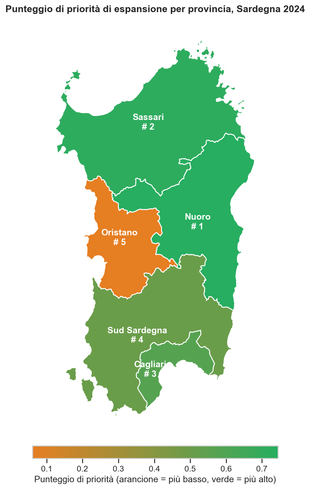

# Sardinia Hospitality Intelligence <a href="../README.md"></a>


[](https://codecov.io/gh/aleattene/sardinia-hospitality-intelligence)


Progetto di **Data Analysis** end-to-end che mappa la domanda turistica e l'offerta
ricettiva delle province sarde su open data ISTAT, individuando gap geografici e
stagionali a supporto di decisioni di espansione data-driven nel settore ricettivo.

---

## Domande di business

L'analisi risponde a cinque domande chiave per operatori e investitori del settore ricettivo in Sardegna:

1. **Dove il gap domanda-offerta è più ampio?** Quali province mostrano il maggiore squilibrio tra arrivi turistici e capacità ricettiva?
2. **Qual è il profilo stagionale?** Come si distribuisce la domanda nei mesi, e quali province sono meno stagionali?
3. **Chi sono i turisti?** Come si differenziano visitatori italiani e internazionali per provincia e tipo di struttura?
4. **Quali segmenti crescono più in fretta?** Quali tipi di struttura e quali provenienze mostrano la crescita anno su anno più forte?
5. **Dove conviene espandersi per primi?** Quali province ottengono il punteggio più alto in un indice composito di priorità di espansione?

---

## Risultati principali

> Basati su dati ISTAT 2018-2024 per le cinque province sarde.

### Ripresa della domanda

La Sardegna ha assorbito un crollo di circa il 60% degli arrivi nel 2020, è rimbalzata con forza nel 2021-2022 e nel 2024 ha raggiunto **circa 4,44 milioni di arrivi**: circa il **25% sopra i livelli pre-pandemia del 2019** (+2,15 milioni nella sola Sassari).

### Gap domanda-offerta

Tutte le province restano sotto la piena occupazione, ma la pressione è disomogenea.
Nuoro mostra il vincolo di offerta più stretto (**occupancy proxy 55,4%**), seguita da Cagliari (51,3%) e Sud Sardegna (49,4%).
Oristano è la più lontana dalla saturazione (43,0%): capacità disponibile ma domanda debole.

### Stagionalità

Il turismo è fortemente concentrato in estate.
I 3 mesi di punta valgono il **52-66% delle presenze annue** a seconda della provincia.
**Cagliari è la meno stagionale** (quota del mese di picco: 20%, indice: 0,13): il potenziale più alto per strategie destagionalizzate.
Sud Sardegna e Nuoro sono le più concentrate (indice circa 0,19).

### Provenienza dei turisti

I turisti internazionali rappresentano una quota rilevante ovunque, dal **41% (Sud Sardegna)** al **59,5% (Sassari)**.
Sassari e Nuoro attraggono la domanda internazionale più diversificata: un asset per un posizionamento premium.

### Segmenti in crescita più rapida

**Gli affitti brevi sono il motore di crescita dominante** in tutte le province (YoY 2023-2024: +38,7% Sassari, +32,5% Nuoro, +31,1% Sud Sardegna).
Gli hotel crescono più moderatamente (+3-13%), con gli hotel di Oristano in contrazione (-6,3%).

### Priorità di espansione

Il punteggio composito di priorità (occupazione + crescita YoY + quota internazionale) ordina così le province:

| Posizione | Provincia | Punteggio di priorità |
|-----------|-----------|-----------------------|
| 1 | Nuoro | 0,74 |
| 2 | Sassari | 0,72 |
| 3 | Cagliari | 0,58 |
| 4 | Sud Sardegna | 0,50 |
| 5 | Oristano | 0,06 |

**Nuoro** guida per pressione sull'occupazione e quota internazionale; **Sassari** per slancio di crescita e apertura internazionale.

---

## Panoramica geografica

Punteggio di priorità di espansione per provincia: combina pressione sull'occupazione, crescita YoY e quota di turisti internazionali.



---

## Dashboard

Una dashboard interattiva costruita con **Looker Studio** offre una vista live e filtrabile di tutti gli indicatori chiave.

**[Apri la dashboard](https://lookerstudio.google.com/s/v2XX9XVY8Zk)**

### Flusso dei dati

```text
DuckDB (database analitico)
  └── step_03_export.py
        ├── file CSV (locali, sempre)
        └── Google Sheets (opt-in, su richiesta esplicita)
              └── Looker Studio (connettore live, auto-refresh)
```

La pipeline esporta le tabelle analitiche in CSV per default. Quando `PUSH_TO_SHEETS=true`
è impostato esplicitamente, gli stessi dati vengono anche inviati a Google Sheets, che
Looker Studio legge come sorgente dati live.
Deve essere impostato anche `GOOGLE_SHEETS_SPREADSHEET_ID` con l'ID dello spreadsheet di destinazione.
L'autenticazione usa il Keychain macOS (zero credenziali su disco o in variabili d'ambiente).

---

## Perimetro di analisi

- **Unità di analisi:** provincia (province sarde)
- **Dimensioni:** geografica (provincia), tipo di struttura, provenienza (italiani / internazionali), temporale (anno + mese)
- **KPI principali:**

| KPI | Formula | Interpretazione |
|-----|---------|-----------------|
| Occupancy Proxy | `nights / (beds × 365) × 100` | Tasso di occupazione dei posti letto (%): presenze per letto nell'anno |
| Gap domanda-offerta | `beds - arrivals` | Stima assoluta di sotto/sovra-offerta |
| Punteggio di priorità | `(occupancy_norm + yoy_norm + intl_share_norm) / 3` | Priorità composita di espansione a pesi uguali (0-1) |

---

## Output dell'analisi

| Output | Descrizione |
|--------|-------------|
| Ranking del gap domanda-offerta | Per provincia, con occupancy proxy (%), arrivi, presenze e posti letto |
| Ranking di priorità di espansione | Province valutate su 3 componenti a pesi uguali: pressione sull'occupazione, crescita YoY, quota internazionale |
| Profilo di stagionalità | Distribuzione mensile della domanda per provincia, indice di concentrazione alla Herfindahl |
| Segmentazione per provenienza | Ripartizione italiani vs internazionali per provincia |
| Crescita anno su anno | Segmenti in maggiore crescita per tipo di struttura e provincia |
| Visualizzazione geografica | Mappa coropletica delle province sarde |
| Dashboard interattiva | [Dashboard Looker Studio](https://lookerstudio.google.com/s/v2XX9XVY8Zk) |

---

## Fonti dati

L'analisi usa due dataset open data di fonte ISTAT, pubblicati dal
[portale open data dell'Osservatorio del Turismo della Regione Sardegna](https://osservatorio.sardegnaturismo.it/it/open-data):

| Fonte | Descrizione | Granularità |
|-------|-------------|-------------|
| **Movimento clienti** | Arrivi e presenze dei turisti negli esercizi ricettivi | Provincia × mese × anno × tipo × provenienza |
| **Capacità ricettiva** | Capacità degli esercizi (strutture, posti letto, camere) | Provincia × anno × tipo |

> **Privacy by design:** i dati ISTAT sono già aggregati alla raccolta.
> Nessun dato personale (PII) viene trattato o memorizzato.

---

## Stato del progetto

- [x] Pipeline ETL (ingest, transform SQL, export)
- [x] Notebook EDA con 16 figure
- [x] Report esecutivo
- [x] Test (coverage 93%) e CI
- [x] Dashboard interattiva Looker Studio
- [ ] Versione italiana di README, report e figure (in corso)
- [ ] Aggiornamento dei dati con le annate più recenti del portale (in programma)
- [ ] Analisi statistica e forecasting della domanda (in programma)

---

## Struttura del progetto

```text
project_root/
├── run_pipeline.py                    # Orchestratore ETL: da CSV a DuckDB a export
├── requirements.in                    # Dipendenze runtime (pip-tools)
├── requirements-test.in               # Runtime + pytest (usato dalla CI)
├── requirements-dev.in                # Set completo per lo sviluppo locale
├── requirements*.txt                  # Generati da pip-compile (versioni pinnate)
├── pyproject.toml                     # Config black, pytest, coverage
├── it/
│   └── README.md                      # Questa pagina (versione italiana)
├── src/
│   ├── config.py                      # Configurazione centralizzata (variabili d'ambiente)
│   ├── utils/                         # Utility condivise (logging, helper DB, runtime)
│   ├── sheets/                        # Push Google Sheets (auth Keychain, gspread)
│   └── pipeline/
│       ├── step_01_ingest.py          # CSV ISTAT in tabelle raw DuckDB
│       ├── step_02_transform.py       # Views SQL e tabelle aggregate
│       └── step_03_export.py          # Da DuckDB a CSV + push opzionale a Google Sheets
├── sql/
│   ├── schema.sql                     # DDL: tabelle raw
│   ├── views/                         # Views analitiche (domanda, offerta, gap, stagionalità...)
│   └── queries/                       # Query materializzate (priority score, ranking...)
├── data/                              # Directory dati (gitignored)
│   ├── raw/                           # CSV ISTAT originali
│   ├── db/                            # File DuckDB
│   └── analysis/                      # CSV di output per il notebook
├── data_sample/                       # Dati di esempio schema-conformi (committati)
│   └── geo/                           # Dati geografici di riferimento: confini delle province sarde (GeoJSON)
├── notebooks/
│   └── 01_eda_demand_supply.ipynb     # Notebook di analisi esplorativa
├── reports/
│   ├── REPORT.md                      # Report esecutivo (EN)
│   ├── it/
│   │   └── REPORT.md                  # Report esecutivo (IT)
│   └── figures/                       # Figure EN generate dal notebook (in figures/it/ le versioni IT)
└── tests/
    ├── conftest.py                    # Fixture condivise e DuckDB in-memory
    ├── test_smoke.py                  # Smoke test leggeri (senza variabili d'ambiente)
    ├── test_pipeline.py               # Test unitari e di integrazione per pipeline e utility
    └── test_sql_views.py              # Views e query SQL testate su DuckDB con data_sample
```

---

## Stack

| Componente | Tecnologia |
|------------|------------|
| Linguaggio | Python 3.13 |
| Database analitico | DuckDB |
| Manipolazione dati | Pandas, NumPy |
| Visualizzazione | Matplotlib, Seaborn |
| Notebook | Jupyter |
| Visualizzazione geografica | GeoPandas |
| Integrazione Google Sheets | gspread, keyring (Keychain macOS) |
| Testing | pytest, pytest-cov |
| Dashboard | Looker Studio (connettore live su Google Sheets) |

---

## Riproducibilità

```bash
# 1. Installare le dipendenze
pip install pip-tools
pip-compile requirements.in
pip-sync requirements.txt

# 1b. Installare gli hook pre-commit (rimuove gli output dei notebook prima di ogni commit)
pre-commit install

# 2. Configurare l'ambiente
cp .env.example .env
# I valori di default sono sufficienti: la pipeline elabora i dati locali.

# 3. Dati: scaricare i CSV dal portale open data (link nella sezione Fonti dati)
#    e collocarli in data/raw/

# 4. Eseguire la pipeline (nessuna chiamata remota: elabora i CSV in data/raw/)
python -m run_pipeline

# 5. Eseguire la suite di test
pytest
pytest --cov=src --cov-report=term-missing  # con coverage

# 6. Eseguire il notebook EDA
jupyter notebook notebooks/01_eda_demand_supply.ipynb
```

> La pipeline **non effettua chiamate remote**: elabora i CSV presenti in `data/raw/`,
> scaricati dal portale open data dell'Osservatorio del Turismo della Regione Sardegna.

---

## Report e dashboard

- [Report esecutivo (IT)](../reports/it/REPORT.md)
- [Notebook EDA](../notebooks/01_eda_demand_supply.ipynb)
- [Dashboard interattiva Looker Studio](https://lookerstudio.google.com/s/v2XX9XVY8Zk)

---

## Autore

Alessandro Attene
