# Sardinia Hospitality Intelligence — Executive Report

> **Data-driven analysis of tourism demand and accommodation supply across Sardinian provinces**
> Data: ISTAT open data, 2018–2024 · Analysis date: April 2025

> **Regenerating figures:** All charts in this report are produced by
> [`notebooks/01_eda_demand_supply.ipynb`](../notebooks/01_eda_demand_supply.ipynb).
> Run `jupyter nbconvert --to notebook --execute notebooks/01_eda_demand_supply.ipynb --inplace`
> to rebuild the PNG files in `reports/figures/`.

---

## Executive Summary

Sardinia's tourism market has completed a full post-pandemic recovery and now surpasses
pre-pandemic levels by approximately **25%**, reaching **4.44 million arrivals in 2024**.
Growth is unevenly distributed across provinces, and a persistent mismatch between demand
concentration and accommodation capacity creates both risks and actionable opportunities.

**Five headline numbers:**

| Metric | Value |
|--------|-------|
| Total arrivals — 2024 | ~4.44 M (+25% vs. 2019) |
| Highest occupancy pressure | Nuoro — 55.4% |
| Fastest-growing segment | Sassari / Short-term rentals (+38.7% YoY) |
| Least seasonal province | Cagliari (seasonality index 0.13) |
| Top expansion priority | Nuoro (composite score 0.74) |

**Key findings:**
- **Supply gap is real but not uniform.** Nuoro and Cagliari face meaningful occupancy pressure;
  Oristano has available capacity but weak demand to fill it.
- **Short-term rentals are reshaping the market.** Non-hotel accommodation is growing at 3–4×
  the rate of traditional hotels and is now the primary growth driver in every province.
- **Seasonal concentration is the structural risk.** Over half of annual overnight stays
  occur in a 3-month summer window; strategies that extend the season can unlock year-round
  revenue in provinces like Cagliari.

---

## 1. Data & Methodology

### Data sources

| Dataset | Source | Coverage |
|---------|--------|----------|
| Tourist flows (`raw_tourism_flows`) | ISTAT — Movimento clienti negli esercizi ricettivi | Province × month × year × accommodation type × origin |
| Accommodation capacity (`raw_accommodation_capacity`) | ISTAT — Capacità degli esercizi ricettivi | Province × year × accommodation type |

Both datasets are ISTAT open data (no authentication required). Coverage: **2018–2024**
across five Sardinian provinces: Cagliari, Sassari, Nuoro, Sud Sardegna, Oristano.

### Pipeline

```
CSV (ISTAT) → DuckDB (raw tables)
           → SQL views (aggregations, segmentations, YoY trends)
           → SQL queries (priority score, seasonality index, growth rankings)
           → CSV export → Jupyter notebook (EDA, visualisations)
```

All transformations are expressed as pure SQL files (`sql/views/`, `sql/queries/`) and
executed against a local DuckDB instance — no server required.

### Key metric — Occupancy proxy

Due to the absence of booking-level data, occupancy is approximated as:

```
occupancy_proxy (%) = total_nights / (total_beds × 365) × 100
```

This metric measures utilisation of the available bed stock under the assumption that all
beds are available every day of the year. It underestimates true in-season occupancy
(beds are not uniformly available year-round) but provides a consistent, comparable
proxy across provinces and years.

---

## 2. Demand Recovery (2018–2024)

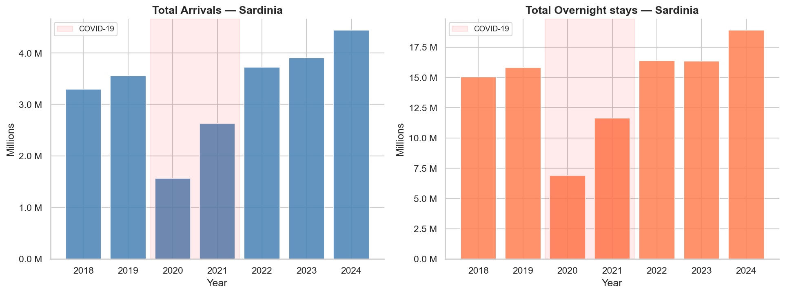

Sardinian tourism experienced a **~60% collapse in arrivals during 2020** due to the
COVID-19 pandemic, followed by a sharp rebound in 2021–2022. By 2023, the region had
fully recovered to 2019 baseline levels; by 2024, it comfortably exceeded them.

**2024 snapshot by province:**

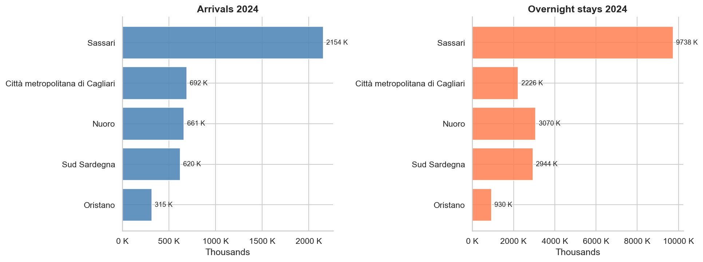

| Province | Arrivals 2024 | Overnight stays 2024 |
|----------|--------------|---------------------|
| Sassari | Highest | Highest |
| Cagliari | 2nd | 2nd |
| Sud Sardegna | 3rd | 3rd |
| Nuoro | 4th | 4th |
| Oristano | Lowest | Lowest |

**Provincial trajectories:**

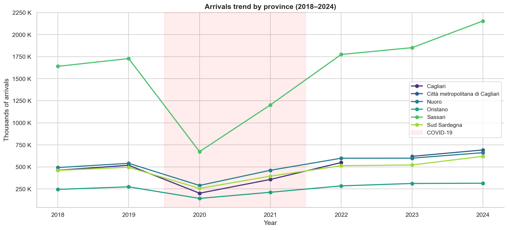

Sassari led the recovery, adding approximately **+2.15 million arrivals** compared to its
2019 baseline — driven by strong growth in non-hotel accommodation and high international
demand. Oristano showed the weakest recovery and the lowest absolute volumes throughout
the period.

---

## 3. Supply–Demand Gap

### Occupancy proxy — 2024 snapshot

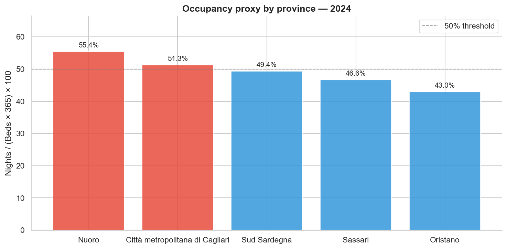

In 2024, no province has reached a saturation level (typically defined as >70% occupancy),
which signals room for accommodation expansion across the board. However, the pressure
is concentrated:

| Province | Occupancy proxy (2024) | Interpretation |
|----------|------------------------|----------------|
| Nuoro | **55.4%** | Tightest constraint — expansion justified |
| Cagliari | **51.3%** | Moderate pressure — selective expansion viable |
| Sud Sardegna | **49.4%** | Near threshold — monitor trend |
| Sassari | ~48% | Growing fast — watch for near-term tightening |
| Oristano | **43.0%** | Significant slack — demand activation needed first |

### Occupancy trend over time

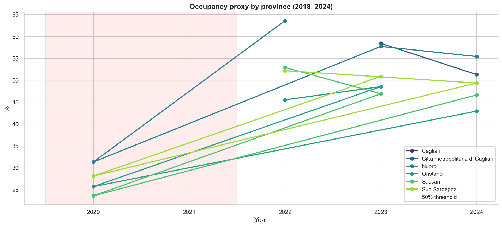

The time-series shows a consistent upward trend post-2020 for Nuoro and Cagliari,
suggesting that demand has been recovering faster than capacity has been added.
Oristano's occupancy has remained flat — the capacity exists but is not being activated
by demand.

---

## 4. Seasonality

### Monthly concentration

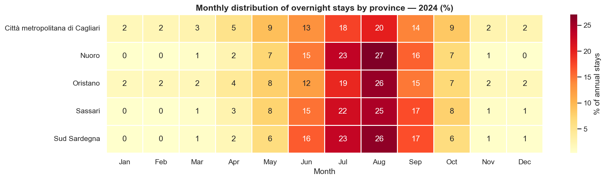

Across all provinces, tourism is dominated by a **narrow summer window**. July and August
alone account for the majority of annual stays. The heatmap reveals almost no activity
in November–February in most provinces, particularly Nuoro and Sud Sardegna.

### Seasonality index

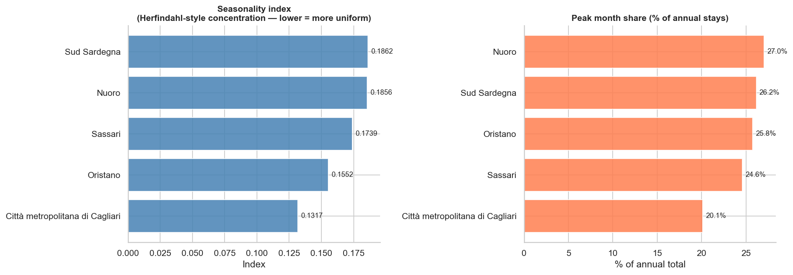

The seasonality index is calculated as the Herfindahl concentration of monthly shares:

```
seasonality_index = Σ (month_share²)    for all 12 months
```

A perfectly flat year-round distribution yields 0.0833 (1/12); a fully concentrated
single-month season yields 1.0. Higher values indicate greater seasonal risk.

| Province | Seasonality index | Peak month share | Top 3 months share |
|----------|------------------|-----------------|-------------------|
| Cagliari | **0.13** | **20%** | ~52% |
| Sassari | ~0.15 | ~23% | ~57% |
| Sud Sardegna | ~0.19 | ~28% | ~64% |
| Nuoro | ~0.19 | ~28% | ~66% |
| Oristano | ~0.16 | ~24% | ~58% |

**Cagliari stands out** as the least seasonal province (index 0.13, peak month 20% of
annual stays) — the strongest candidate for year-round strategies such as conference
tourism, cultural events, and off-season packages.

---

## 5. Tourist Segmentation

### Origin: domestic vs. international

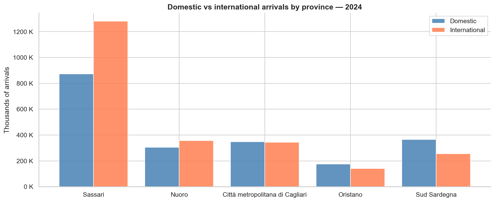

International tourists represent a substantial and strategically valuable segment across
all provinces. They typically exhibit higher spending per stay and are less price-elastic
than domestic tourists.

| Province | International share (2024) |
|----------|-----------------------------|
| Sassari | **59.5%** — most internationally diverse |
| Nuoro | ~55% |
| Cagliari | ~50% |
| Sud Sardegna | **41%** — most domestically oriented |

### Top source markets

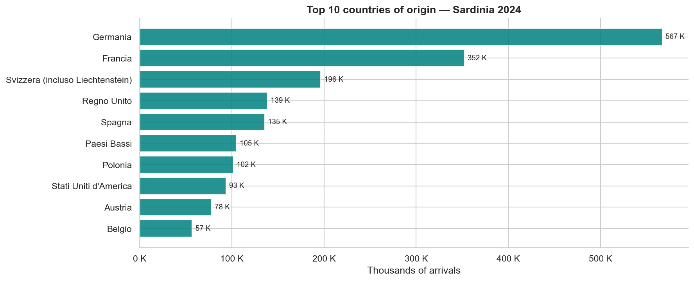

European markets dominate international arrivals. **Germany, France, and the United
Kingdom** are the top three source countries, reinforcing the importance of northern
European connectivity (air routes, ferry links) for the island's tourism economy.

---

## 6. Accommodation Trends

### Market mix by province

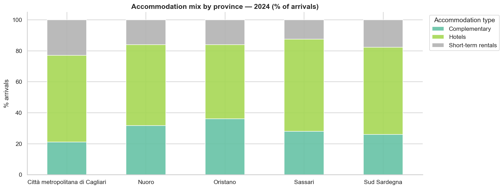

Short-term rentals (private apartments, B&Bs, vacation homes) now account for a
significant share of arrivals in every province. Their growth trajectory is outpacing
traditional hotels by a wide margin.

### Average length of stay

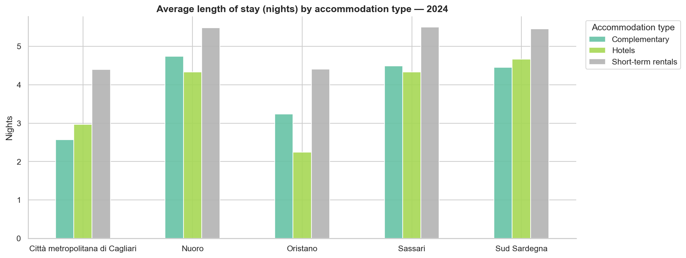

Short-term rental guests stay longer on average than hotel guests — a pattern observed
consistently across all provinces. This signals a qualitatively different tourist profile:
vacation-mode travellers rather than transient or business guests.

### Year-over-year growth by segment

| Province | Accommodation type | YoY arrivals growth (2023→2024) |
|----------|-------------------|-------------------------------|
| Sassari | Short-term rentals | **+38.7%** |
| Nuoro | Short-term rentals | **+32.5%** |
| Sud Sardegna | Short-term rentals | **+31.1%** |
| Cagliari | Short-term rentals | ~+25% |
| Oristano | Short-term rentals | ~+20% |
| Cagliari | Hotels | +13% |
| Sassari | Hotels | +8% |
| Oristano | Hotels | **−6.3%** |

The short-term rental boom is a market-wide structural shift. Hotel contraction in
Oristano (−6.3%) reflects the combination of weak demand and competitive displacement
by more flexible accommodation formats.

---

## 7. Expansion Targeting

### Priority score model

To rank provinces by expansion attractiveness, a **composite priority score** is computed
from three equally-weighted components, each min-max normalised to the [0, 1] range:

| Component | Proxy for | Weight |
|-----------|-----------|--------|
| Occupancy proxy | Current supply constraint | 1/3 |
| YoY arrivals growth | Market momentum | 1/3 |
| International share | Premium segment potential | 1/3 |

```
priority_score = mean(occupancy_norm, yoy_growth_norm, intl_share_norm)
```

### Province ranking

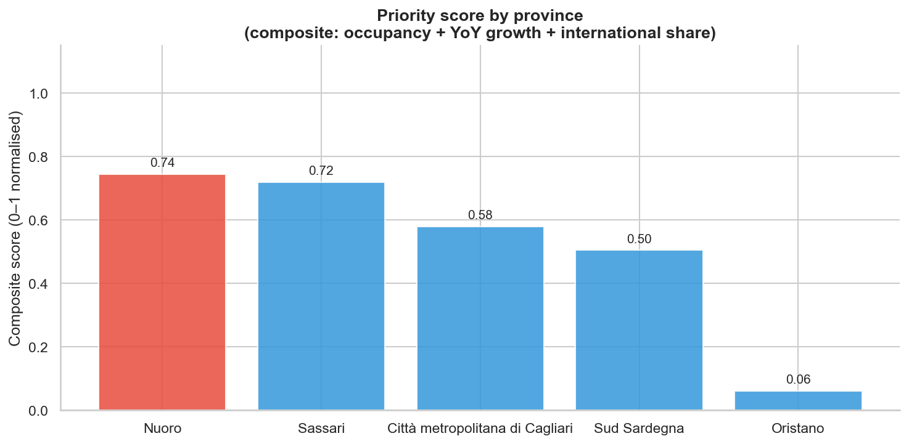

| Rank | Province | Score | Occupancy | YoY growth | Intl share |
|------|----------|-------|-----------|------------|------------|
| 1 | **Nuoro** | 0.74 | 55.4% | High | ~55% |
| 2 | **Sassari** | 0.72 | ~48% | Highest | 59.5% |
| 3 | Cagliari | 0.58 | 51.3% | Moderate | ~50% |
| 4 | Sud Sardegna | 0.50 | 49.4% | Moderate | 41% |
| 5 | Oristano | 0.06 | 43.0% | Low | Low |

### Top growth segments

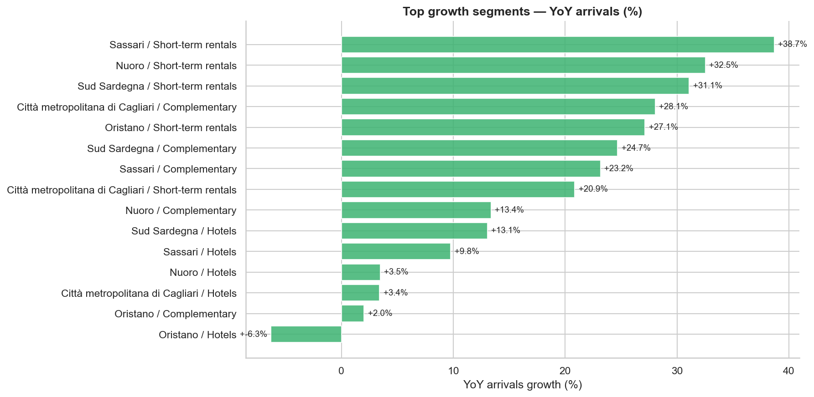

### Strategic positioning map

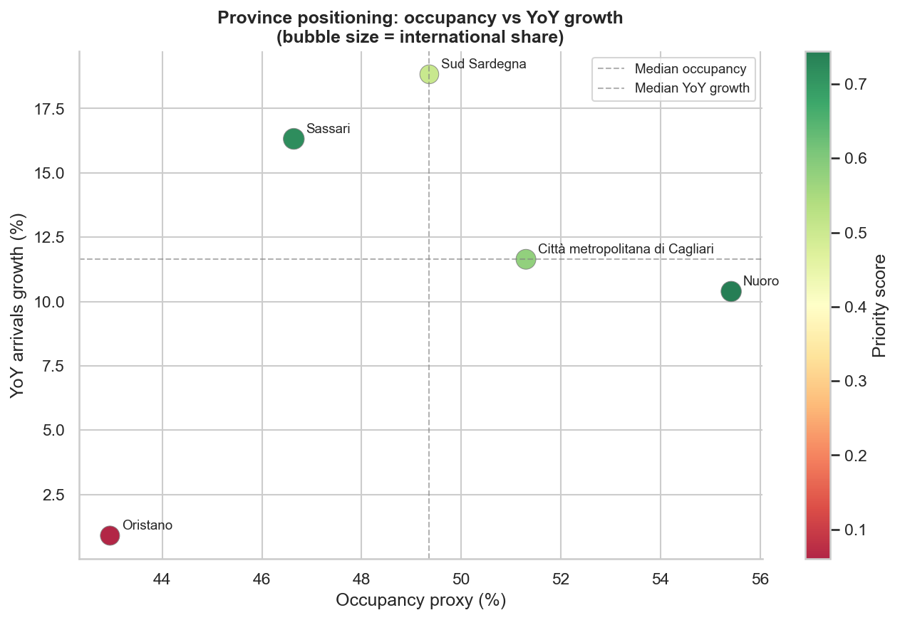

The bubble chart places each province on a two-dimensional grid of **occupancy pressure**
(x-axis) vs. **growth momentum** (y-axis). Bubble size is proportional to international
share. Provinces in the **upper-right quadrant** (high occupancy + fast growth) represent
the most urgent expansion cases.

- **Nuoro and Sassari** occupy the upper-right quadrant — both capacity-constrained and
  growing quickly.
- **Cagliari** sits near the median lines — balanced position suitable for steady, measured
  expansion.
- **Oristano** falls in the lower-left quadrant — demand stimulation must precede supply
  investment.

---

## 8. Recommendations

### Nuoro — Priority: High

Nuoro shows the highest occupancy pressure (55.4%) and strong international demand (~55%).
The market is absorbing new capacity, and short-term rentals are growing rapidly.

- **Expand accommodation capacity**, particularly non-hotel formats (agriturismi, boutique
  rentals) aligned with nature and cultural tourism positioning.
- **Target international premium segments** — Central European markets (Germany, Switzerland,
  Austria) with hiking, cycling, and authentic local-culture experiences.
- **Invest in infrastructure** (accessibility, local transport) to reduce friction for
  international visitors arriving via Cagliari or Olbia gateways.

### Sassari — Priority: High

Sassari leads in YoY growth (+38.7% for short-term rentals) and has the highest
international share (59.5%) of any province.

- **Capitalise on momentum** — accelerate short-term rental infrastructure, streamline
  permit processes to formalise the supply side.
- **Grow international marketing presence** in UK, Germany, and France — the top three
  source markets already showing strong engagement.
- **Develop shoulder-season offerings** (spring cultural events, autumn food & wine tourism)
  to reduce dependence on the summer peak.

### Cagliari — Priority: Medium-High

Cagliari combines a moderate occupancy pressure (51.3%) with the **lowest seasonality**
of all provinces — making it the best platform for year-round strategies.

- **Invest in conference and MICE (Meetings, Incentives, Conferences, Events) infrastructure**
  to attract business travel outside the summer season.
- **Expand boutique hotel and design accommodation** supply to capture the growing urban-break
  segment from European cities.
- **Leverage the lowest seasonality** index to negotiate with airlines on year-round route
  maintenance, reducing the seasonal flight schedule cliff.

### Sud Sardegna — Priority: Medium

Sud Sardegna has a domestic-skewed tourist base (41% international) and moderate occupancy
(49.4%). Growth is present but below Nuoro/Sassari pace.

- **Improve international visibility** — targeted marketing in France and Germany for
  coastal/beach tourism, which aligns with the province's coastal geography.
- **Monitor occupancy ceiling** — if the current growth trajectory continues, supply
  constraints will emerge within 2–3 years.
- **Invest in sustainable coastal infrastructure** to protect the long-term attractiveness
  of the destination for the premium international segment.

### Oristano — Priority: Low (demand activation phase)

With occupancy at 43.0%, hotels contracting (−6.3% YoY), and the lowest priority score
(0.06), Oristano should focus on **stimulating demand before adding supply**.

- **Activate niche tourism** — Oristano's lagoon ecosystem (Stagno di Cabras), archaeology
  (Tharros), and wetland bird-watching represent under-marketed differentiated assets.
- **Partner with tour operators** to create curated itineraries combining Oristano with
  higher-traffic provinces (Cagliari day-trips, Nuoro multi-day circuits).
- **Defer large-scale accommodation investment** until demand metrics (arrivals, occupancy)
  show a sustained recovery above 48–50% occupancy proxy.

---

## Appendix

### Data sources

| Source | URL |
|--------|-----|
| ISTAT — Movimento clienti | [dati.istat.it](https://dati.istat.it) |
| ISTAT — Capacità ricettiva | [dati.istat.it](https://dati.istat.it) |

### Field definitions

| Field | Definition |
|-------|-----------|
| `arrivals` | Number of guests checking in to accommodation in the reference period |
| `nights` | Total overnight stays (guest-nights) in the reference period |
| `occupancy_proxy` | `(total_nights / (total_beds × 365)) × 100` |
| `seasonality_index` | Herfindahl concentration of 12 monthly night shares: `Σ(month_share²)` |
| `priority_score` | Equal-weight mean of min-max normalised occupancy, YoY growth, international share |

### Caveats

- **Occupancy proxy** is a lower-bound estimate of in-season occupancy; it assumes all
  beds are available 365 days per year.
- **2021 accommodation capacity data** is missing province-level detail in the ISTAT source —
  affected records are excluded from supply-demand gap calculations for that year.
- **Schema change 2022→2023:** ISTAT removed the `origin_macro` field from tourist flow data,
  requiring a classification rule to maintain the domestic/international segmentation.
- **Province scope:** Analysis covers the five current Sardinian provinces. The "Sud Sardegna"
  province was created in 2016 by merging parts of Cagliari and Carbonia-Iglesias; historical
  data pre-2018 is not directly comparable.
