# Sardinia Hospitality Intelligence: Executive Report <a href="#"></a> <a href="it/REPORT.md"></a>

> **Data-driven analysis of tourism demand and accommodation supply across the Sardinian provinces**

> **Data**: ISTAT-sourced open data, 2018-2024. Next updates: the 2025 vintage in
> autumn 2026, the 2026 vintage in the first quarter of 2027.

> **Author**: [Alessandro Attene](https://www.linkedin.com/in/aleattene)

> **Analysis started**: April 2026

> **Last revision**: August 2026

---

## Executive summary

Sardinia's tourism market has completed a full post-pandemic recovery and now surpasses
pre-pandemic levels by approximately **25%**, reaching **4.44 million arrivals and
almost 19 million overnight stays in 2024**.

Growth is unevenly distributed across provinces, and a persistent mismatch between
demand concentration and accommodation capacity creates both **risks** and
**opportunities**.

### The five headline numbers:

| Metric | Value |
|--------|-------|
| Total arrivals 2024 | ~4.44 M (+25% vs 2019) |
| Highest pressure on supply | Nuoro: 15.2% occupancy proxy (55 nights sold per bed per year) |
| Fastest-growing segment | Sassari with short-term rentals (+38.7% Year over Year, 2024 vs 2023) |
| Least seasonal province | Cagliari (seasonality index 0.13\*) |
| Top expansion priority | Nuoro (composite score 0.74\*\*) |

\* The seasonality index measures how much overnight stays concentrate in a few
months: it goes from 0.08 (uniform across the year) to 1 (all in a single month).
Details in Sec. 4.

\*\* The composite score is the mean of three levers normalized on a 0-1 scale
(occupancy pressure, growth, international share):
- 1: best on all levers
- 0: worst on all

Details in Sec. 7.

### Key findings:
- **The supply gap is relative, not absolute.** Annual bed utilization stays low
  everywhere (11.8-15.2%) because demand compresses into a few summer weeks. It is
  the comparison across provinces that guides the choices:
  - Nuoro and Cagliari lead the pressure
  - Oristano has ample capacity, but demand still too weak to put it to use
- **Short-term rentals are reshaping the market.** Non-hotel accommodation grows at
  3-4 times the pace of traditional hotels and is the primary growth driver in almost
  every province.
- **Seasonal concentration is the structural risk.** The top 3 months hold 52-66% of
  annual overnight stays. Season-extension strategies can unlock year-round revenue
  in provinces like Cagliari.

**Recommended actions:**

- In **Nuoro** and **Sassari**, where supply pressure and growth momentum coincide,
  concentrate the first capacity expansions.
- In **Cagliari**, the least seasonal province, build year-round demand: conferences,
  events, city breaks.
- In **Oristano** supply is already abundant relative to demand: activate new flows
  first (promotion, itineraries, niche tourism), and only then invest in new
  facilities.

---

## 1. Context, data and methodology

### Business questions

Each question is translated into its analytical approach, that is the metric and the
method through which the data answers it, with a pointer to the section that addresses it:

| Area | Business question | Analytical approach | Answer |
|------|-------------------|---------------------|--------|
| **Geographic gap** | Where is the demand-supply divide widest? | Occupancy proxy by province (overnight stays vs beds) | Sec. 3 |
| **Seasonality** | What is the seasonal profile and who is least exposed to it? | Monthly shares and Herfindahl-style concentration index\* | Sec. 4 |
| **Segmentation** | Who are the tourists, by origin and accommodation type? | Domestic/international split and accommodation mix | Sec. 5, 6 |
| **Growth** | Which segments are growing fastest? | YoY\*\* arrivals growth by province × accommodation type | Sec. 6 |
| **Expansion sequence** | Where should operators expand first? | Composite score: occupancy, growth, international share | Sec. 7, 8 |

\* An index borrowed from economics (Herfindahl-Hirschman, where it measures how
concentrated a market is): the 12 monthly shares of stays are squared and summed, so
dominant months weigh far more than marginal ones. It goes from 0.08 (uniform stays
all year) to 1 (all stays in a single month). The full calculation is in Sec. 4.

\*\* YoY (Year over Year): percentage change against the same figure of the previous
year.

### Data sources

| Dataset | Source | Coverage |
|---------|--------|----------|
| Tourist flows (`stg_tourism_flows`) | ISTAT: Movimento clienti negli esercizi ricettivi | Province × month × year × accommodation type × origin |
| Accommodation capacity (`stg_accommodation_capacity`) | ISTAT: Capacità degli esercizi ricettivi | Province × year × accommodation type |

The names in parentheses are the DuckDB tables the pipeline loads the raw files into:
one CSV per vintage, following the patterns `sardinia_customer_movements_<year>.csv`
and `sardinia_accommodation_capacity_<year>.csv`, placed in `data/raw/`.

Both datasets are ISTAT-sourced open data, downloaded from the open data portal of the
Sardinia Tourism Observatory (no authentication required).

Coverage: **2018-2024** for the five Sardinian provinces: Cagliari, Sassari, Nuoro,
Sud Sardegna, Oristano. The update with the 2025 vintage is planned for autumn 2026,
the one with the 2026 vintage for the first quarter of 2027.

### Pipeline: from raw data to business insights

The flow starts from the CSV files downloaded from the open data portal and runs all
the way to the answers to the business questions above, in the form of the report and
the interactive dashboard:

```text
ISTAT-sourced CSV files
  └── DuckDB (staging tables)
        └── SQL views (aggregations, segmentations, YoY trends)
              └── SQL queries (priority score, seasonality index, growth ranking)
                    └── CSV export
                          └── Jupyter notebook (EDA, figures)
```

All transformations are expressed as pure SQL files (`sql/views/`, `sql/queries/`)
and run on a local DuckDB instance: no server required.

### Key metric: occupancy proxy

In the absence of booking-level data, occupancy is approximated as:

```
occupancy_proxy (%) = total_nights / (total_beds × 365) × 100
```

The metric measures the utilization of the bed stock under the assumption that every
bed is available every day of the year. An intuitive reading: Nuoro's 15.2% equals 55
nights sold per bed per year.

```
Nuoro 2024:  3,070,225 nights / (55,397 beds × 365) × 100 ≈ 15.2%
             3,070,225 nights / 55,397 beds ≈ 55 nights sold per bed
```

In such a seasonal market the annual value is structurally low (beds work almost only
in summer) and understates real occupancy in peak months: it should therefore be used
as a comparative indicator across provinces and years, not as an absolute fill rate.

---

## 2. Demand recovery (2018-2024)

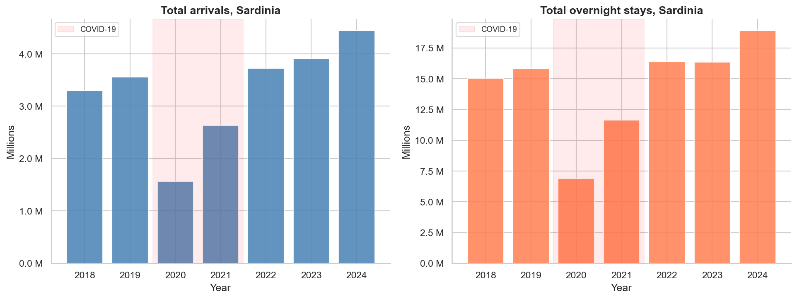

Sardinian tourism suffered a **collapse of roughly 56% of arrivals in 2020** (from
3.56 to 1.56 million) due to the COVID-19 pandemic, followed by a strong rebound in
2021-2022. By 2023 the region had already surpassed 2019 levels; in 2024 it exceeded
them with margin (+25%).

**2024 snapshot by province:**

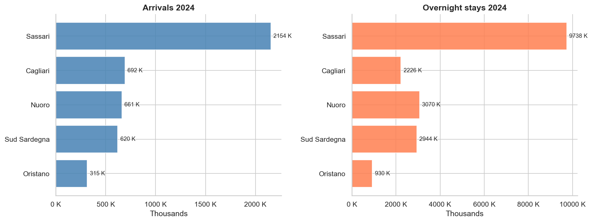

| Province | Arrivals 2024 | Overnight stays 2024 | Average stay (nights) |
|----------|---------------|----------------------|-----------------------|
| Sassari | 2.15 M | 9.74 M | 4.5 |
| Cagliari | 0.69 M | 2.23 M | 3.2 |
| Nuoro | 0.66 M | 3.07 M | 4.6 |
| Sud Sardegna | 0.62 M | 2.94 M | 4.7 |
| Oristano | 0.31 M | 0.93 M | 3.0 |

Sassari dominates both metrics. Note that Cagliari is second by arrivals but only
fourth by overnight stays: the average stay in the capital is among the shortest on
the island (3.2 nights, with only Oristano lower at 3.0), far from the 4.5-4.7 of
Sassari, Nuoro and Sud Sardegna: a city-break profile more than a resort-holiday one.

**Provincial trajectories:**

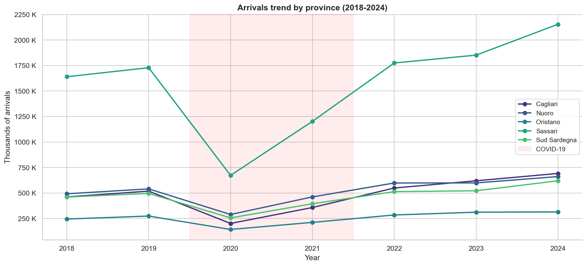

Sassari led the recovery: with 2.15 million arrivals in 2024 it accounts for almost
half of the regional market and, with roughly **+426,000 arrivals over 2019 (+25%)**,
almost half of the entire post-pandemic increase, driven by strong growth of non-hotel
accommodation and high international demand. Oristano showed the weakest recovery and
the lowest absolute volumes throughout the period.

---

## 3. Demand-supply gap

### Occupancy proxy: 2024 snapshot

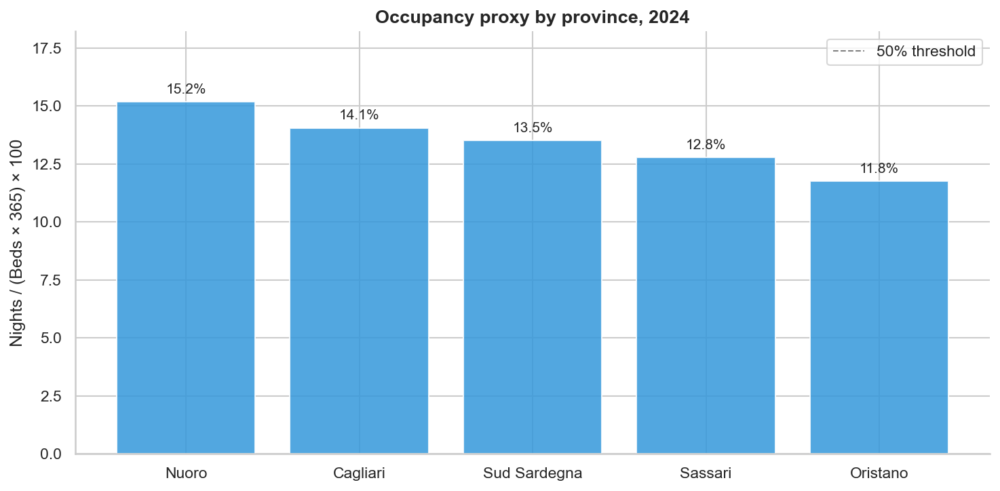

Annual bed utilization stays far from saturation in every province, a direct
consequence of the summer compression of demand (Sec. 4). Relative pressure is
however well differentiated, and the comparison with the bed stock reveals very
different market structures:

| Province | Occupancy proxy 2024 | Nights per bed/year | Beds | Reading |
|----------|----------------------|---------------------|------|---------|
| Nuoro | **15.2%** | 55 | 55,397 | Tightest relative constraint: expansion justified |
| Cagliari | **14.1%** | 51 | 43,381 | Smallest stock among the large provinces: urban-area pressure |
| Sud Sardegna | **13.5%** | 49 | 59,644 | Close to the average: monitor the trend |
| Sassari | **12.8%** | 47 | 208,779 | Huge volumes diluted over a very large stock |
| Oristano | **11.8%** | 43 | 21,642 | Unused headroom: demand activation comes first |

### Occupancy trend over time

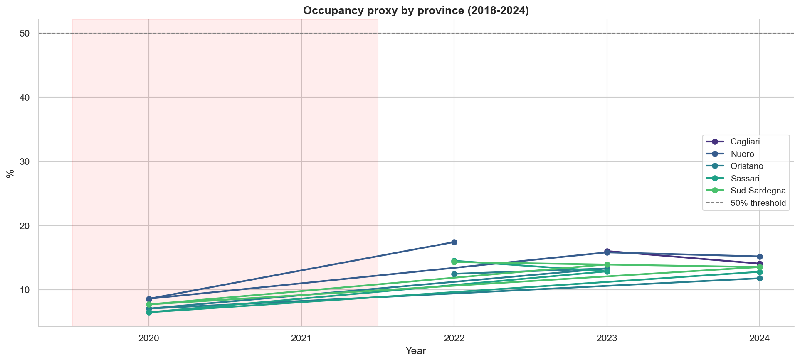

The comparable series starts in 2020 (see the Caveats in the Appendix: 2018-2019
capacity is monthly-grained and 2021 lacks province detail). The pattern is common to
all provinces: a steep climb from the pandemic low to the **2022 peak**, then a slight
easing in 2023-2024. Demand came back first, but over the last two years **supply has
grown faster than demand**: a signal that the market is already responding, and that
the window to position in the provinces under pressure will not stay open for long.

---

## 4. Seasonality

### Monthly concentration

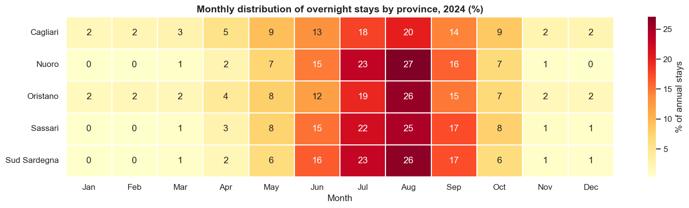

In every province tourism is dominated by a **narrow summer window**: the top 3 months
hold from 52% to 66% of annual overnight stays. The heatmap shows near-zero activity
between November and February in most provinces, particularly Nuoro, Sassari and Sud
Sardegna.

### Seasonality index

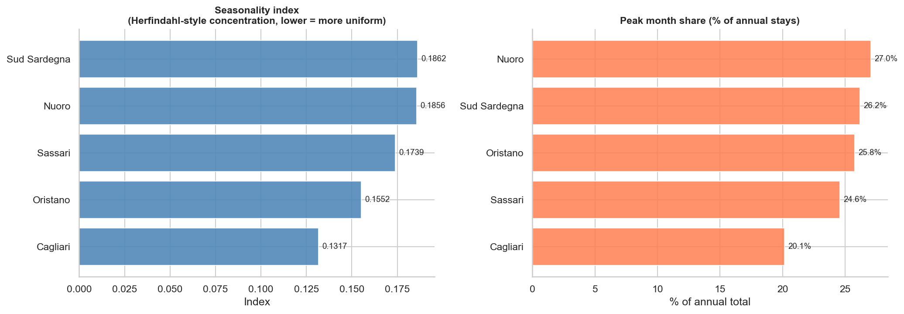

The seasonality index is computed as the Herfindahl-style concentration of monthly shares:

```
seasonality_index = Σ (month_share²)    over all 12 months
```

A perfectly uniform distribution over the year scores 0.0833 (1/12); a season entirely
concentrated in a single month scores 1.0. Higher values indicate higher seasonal risk.

Two concrete examples from 2024. In Cagliari the peak month holds 20.1% of stays and
contributes 0.201² ≈ 0.04 to the index: summing the squared shares of all 12 months
yields 0.132. In Nuoro the peak month alone (27.0%) weighs 0.270² ≈ 0.07 and the index
rises to 0.186: squaring amplifies the dominant months, so a few heavy months push the
index up quickly.

| Province | Seasonality index | Peak month share | Top 3 months share |
|----------|-------------------|------------------|--------------------|
| Cagliari | **0.132** | **20.1%** | 52.2% |
| Oristano | 0.155 | 25.8% | 60.0% |
| Sassari | 0.174 | 24.6% | 63.8% |
| Nuoro | 0.186 | 27.0% | 66.5% |
| Sud Sardegna | 0.186 | 26.2% | 66.3% |

**Cagliari stands out** as the least seasonal province (index 0.132, peak month at
20.1% of annual stays): the strongest candidate for year-round strategies such as
conference tourism, cultural events and off-season packages. Note that the second
least seasonal is Oristano: not because of a successful de-seasonalisation, but
because demand is weak even in peak months. The same index value tells two opposite
stories.

---

## 5. Tourist segmentation

### Origin: domestic vs international

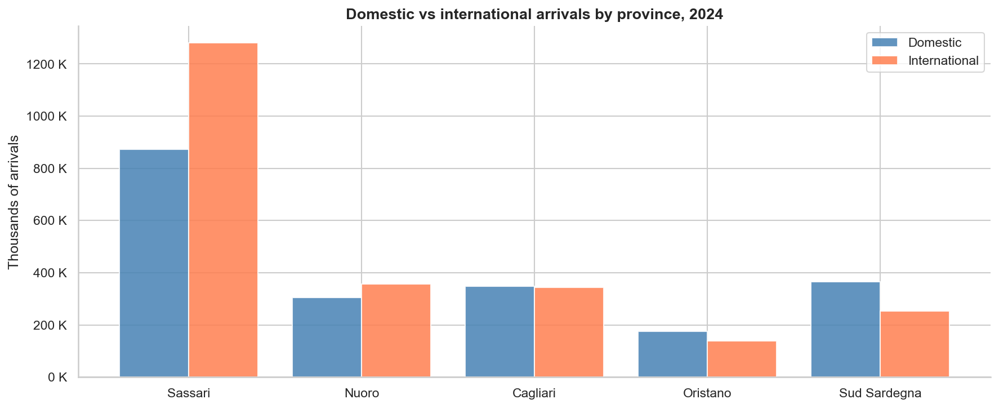

International tourists represent a sizeable and strategically valuable segment in
every province. They typically express a higher spend per stay and a lower price
elasticity than domestic tourists.

| Province | International share (2024) |
|----------|-----------------------------|
| Sassari | **59.5%**: the most internationally diversified |
| Nuoro | 54.0% |
| Cagliari | 49.7% |
| Oristano | 44.4% |
| Sud Sardegna | **41.0%**: the most domestic-oriented |

### Top origin markets

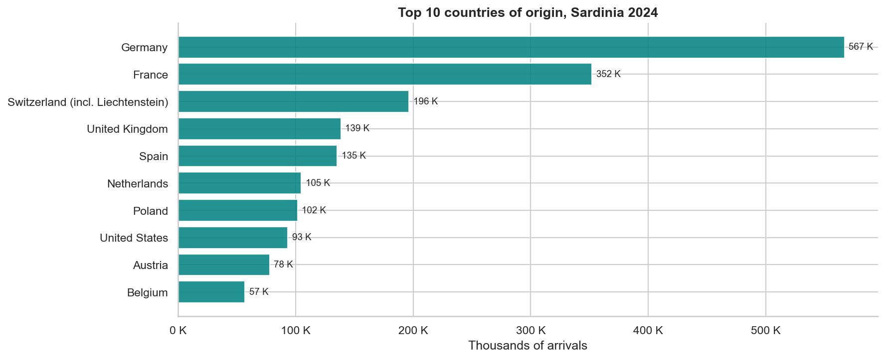

European markets dominate international arrivals. **Germany, France and the United
Kingdom** are the top three countries of origin, confirming the importance of Northern
European connections (air routes, ferries) for the island's tourism economy.

---

## 6. Accommodation supply trends

### Market mix by province

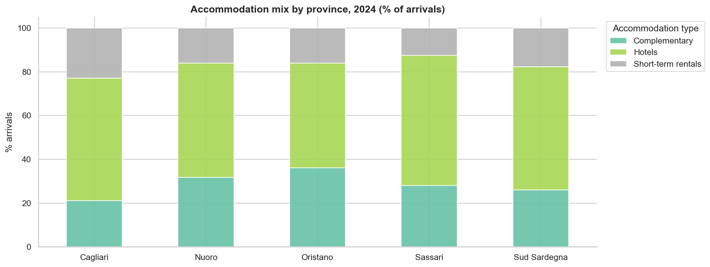

Short-term rentals (private apartments, B&Bs, holiday homes) now account for a
significant share of arrivals in every province. Their growth trajectory far exceeds
that of traditional hotels.

### Average length of stay

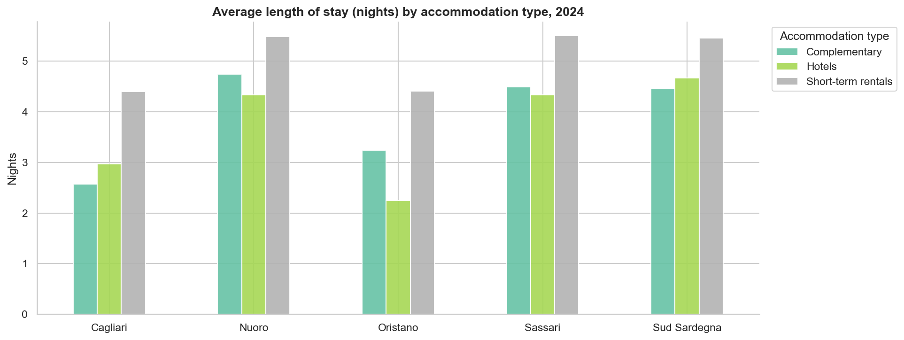

Short-term rental guests stay longer than hotel guests (4.4-5.5 nights against
2.3-4.7), a pattern observed consistently across all provinces. It signals a
qualitatively different tourist profile: travellers in holiday mode rather than
passing-through or business guests.

### Year-over-year growth by segment

| Province | Accommodation type | YoY arrivals growth (2023-2024) |
|----------|--------------------|---------------------------------|
| Sassari | Short-term rentals | **+38.7%** |
| Nuoro | Short-term rentals | **+32.5%** |
| Sud Sardegna | Short-term rentals | **+31.1%** |
| Cagliari | Complementary facilities | +28.1% |
| Oristano | Short-term rentals | +27.1% |
| Cagliari | Short-term rentals | +20.9% |
| Sud Sardegna | Hotels | +13.1% |
| Sassari | Hotels | +9.8% |
| Nuoro | Hotels | +3.5% |
| Cagliari | Hotels | +3.4% |
| Oristano | Hotels | **-6.3%** |

The short-term rental boom is a structural shift of the whole market: they lead
growth in four provinces out of five (in Cagliari the top segment is complementary
facilities). Hotels grow between +3% and +13%; the contraction of Oristano's hotels
(-6.3%) reflects the combination of weak demand and competitive displacement by more
flexible accommodation formats.

---

## 7. Expansion priority

### Priority score model

To rank the provinces by expansion attractiveness, a **composite priority score** is
computed from three equal-weight components, each min-max normalized to the [0, 1]
range:

| Component | Proxy for | Weight |
|-----------|-----------|--------|
| Occupancy proxy | Current supply constraint | 1/3 |
| YoY arrivals growth | Market momentum | 1/3 |
| International share | Premium segment potential | 1/3 |

```
priority_score = mean(occupancy_norm, yoy_growth_norm, intl_share_norm)
```

In plain words: the score is the mean of occupancy, growth and international share,
each min-max normalized: on every lever the worst province scores 0, the best scores
1, the others fall in proportion.

Example with Cagliari (2024): the 14.1% occupancy proxy becomes 0.67 (between
Oristano's 11.8% minimum and Nuoro's 15.2% maximum), the +11.6% growth becomes 0.60
and the 49.7% international share becomes 0.47. The score is the mean of the three:
(0.67 + 0.60 + 0.47) / 3 ≈ 0.58, the value shown in the ranking.

### Province ranking

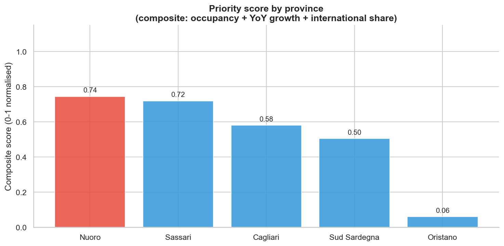

| Rank | Province | Score | Occupancy proxy | YoY growth | Intl share |
|------|----------|-------|-----------------|------------|------------|
| 1 | **Nuoro** | 0.74 | 15.2% (max) | +10.4% | 54.0% |
| 2 | **Sassari** | 0.72 | 12.8% | +16.3% | 59.5% (max) |
| 3 | Cagliari | 0.58 | 14.1% | +11.6% | 49.7% |
| 4 | Sud Sardegna | 0.50 | 13.5% | +18.8% (max) | 41.0% (min) |
| 5 | Oristano | 0.06 | 11.8% (min) | +0.9% (min) | 44.4% |

No province leads on all three components: Nuoro wins on supply pressure with a solid
international profile; Sassari pairs the highest international share with robust
growth. Sud Sardegna has the fastest overall growth on the island (+18.8%), but its
score is held back by the lowest international share. Oristano is last or nearly last
on every component.

### Top growth segments

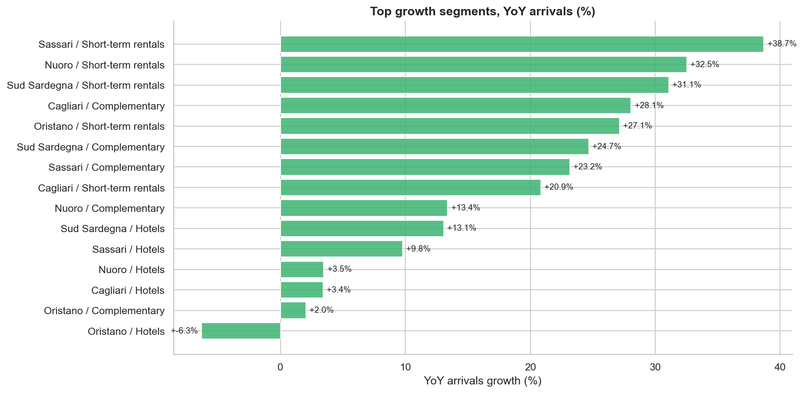

### Strategic positioning map

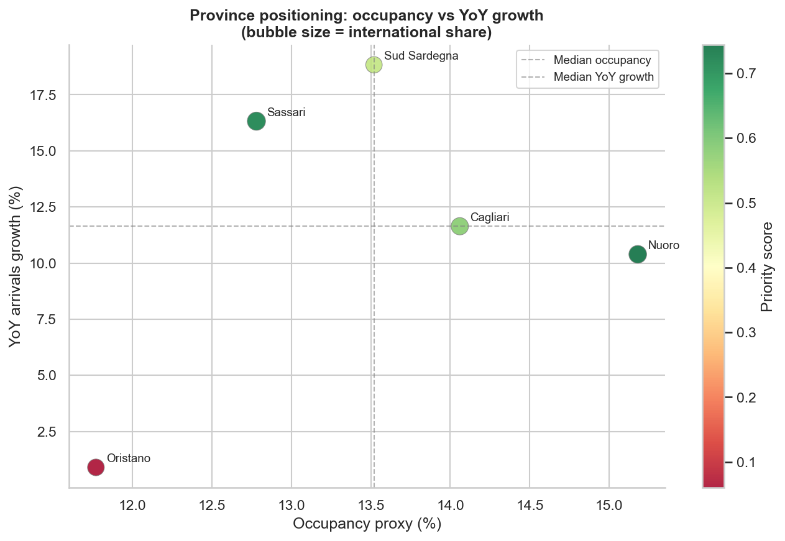

The bubble chart places each province on a two-dimensional grid: **occupancy
pressure** (x axis) and **growth momentum** (y axis). Bubble size is proportional to
the international share.

- The **top-right quadrant is empty**: no province currently pairs maximum pressure
  with maximum growth. It is the quadrant to watch, because whoever enters it first
  (Nuoro if growth accelerates, Sassari or Sud Sardegna if pressure rises) will become
  the most urgent expansion case.
- **Nuoro** has the highest pressure but below-median growth; **Sassari** and
  **Sud Sardegna** lead growth starting from intermediate pressure.
- **Cagliari** sits close to the medians: a balanced position, suited to steady,
  measured expansion.
- **Oristano** falls in the bottom-left quadrant: demand stimulation must precede
  supply investment.

---

## 8. Recommendations

### Nuoro: high priority

Nuoro shows the highest relative pressure on supply on the island (55 nights sold per
bed per year, on a contained stock of ~55,000 beds) and strong international demand
(54%). Short-term rentals grow at +32.5% YoY.

- **Expand accommodation capacity**, particularly in non-hotel formats (farm stays,
  boutique rentals) aligned with the nature-and-culture positioning.
- **Target premium international segments**: Central European markets (Germany,
  Switzerland, Austria) with trekking, cycling and authentic local culture experiences.
- **Invest in infrastructure** (accessibility, local transport) to reduce friction for
  international visitors arriving through the Cagliari and Olbia gateways.

### Sassari: high priority

Sassari leads segment growth (+38.7% for short-term rentals), has the highest
international share (59.5%) and alone accounts for almost half of the regional market.

- **Capitalize on momentum**: accelerate short-term rental infrastructure and simplify
  authorization processes to bring supply to the surface.
- **Strengthen international marketing** towards Germany, France and the United
  Kingdom: the three origin markets already most engaged.
- **Develop shoulder-season offerings** (cultural events in spring, food and wine in
  autumn) to reduce dependence on the summer peak.

### Cagliari: medium-high priority

Cagliari combines above-median pressure on supply (14.1%, with the smallest bed stock
among the large provinces) with the **lowest seasonality** on the island and the
shortest average stay: the best platform for year-round strategies.

- **Invest in conference and MICE infrastructure** (Meetings, Incentives, Conferences,
  Events) to attract business travel outside the summer season.
- **Expand boutique hotels and design accommodation** to capture the growing city-break
  segment from European cities.
- **Leverage the lowest seasonality index** to negotiate year-round route retention
  with airlines, reducing the winter schedule collapse.

### Sud Sardegna: medium priority

Sud Sardegna has the fastest overall growth on the island (+18.8% YoY) but a tourist
base skewed towards the domestic market (41% international) and intermediate pressure
(13.5%).

- **Improve international visibility**: targeted marketing in France and Germany for
  seaside tourism, consistent with the province's coastal geography.
- **Monitor the occupancy ceiling**: if the current growth pace continues, supply
  constraints will emerge here before anywhere else.
- **Invest in sustainable coastal infrastructure** to protect the destination's
  long-term attractiveness for the premium international segment: the international
  tourists with the highest spend per stay and the lowest price sensitivity (see
  Sec. 5).

### Oristano: low priority (demand activation phase)

With the lowest bed utilization on the island (11.8%), near-zero growth (+0.9%) and
contracting hotels (-6.3% YoY), Oristano should focus on **stimulating demand before
adding supply**.

- **Activate niche tourism**: the lagoon ecosystem (Cabras pond), archaeology
  (Tharros) and wetland birdwatching are differentiating assets under-exploited by
  marketing.
- **Partner with tour operators** to create curated itineraries combining Oristano
  with the higher-traffic provinces (day trips from Cagliari, multi-day circuits with
  Nuoro).
- **Defer large-scale accommodation investments** until demand metrics (arrivals,
  occupancy) converge steadily towards the levels of the other provinces (13-14%
  occupancy proxy).

---

## 9. Interactive dashboard

Explore the key metrics interactively on Looker Studio (live view, filterable by year
and province, fed by the same pipeline as this report):

[Open the Looker Studio dashboard](https://lookerstudio.google.com/s/v2XX9XVY8Zk)

The dashboard reflects the 2018-2024 data and will be realigned at every pipeline
update: the next one, with the 2025 vintage, is planned for autumn 2026.

---

## Appendix

### Data sources

| Source | URL |
|--------|-----|
| Tourism Observatory, Sardinia Region: open data (ISTAT-sourced) | [osservatorio.sardegnaturismo.it](https://osservatorio.sardegnaturismo.it/it/open-data) |
| ISTAT: Movimento clienti and Capacità ricettiva (statistical source) | [dati.istat.it](https://dati.istat.it) |

### Field definitions

| Field | Definition |
|-------|------------|
| `arrivals` | Number of guests checking in at the facilities in the reference period |
| `nights` | Total overnight stays (nights per guest) in the reference period |
| `occupancy_proxy` | `(total_nights / (total_beds × 365)) × 100` |
| `seasonality_index` | Herfindahl-style concentration of the 12 monthly shares of stays: `Σ(month_share²)` |
| `priority_score` | Equal-weight mean of occupancy, YoY growth and international share, min-max normalized |

Fields verified against the pipeline outputs: in the aggregate tables and exported CSV
files, `arrivals` and `nights` appear in the aggregated forms `total_arrivals` and
`total_nights`.

### Caveats

- The **occupancy proxy** underestimates high-season occupancy: it assumes every bed
  is available 365 days a year. Useful equivalence: 1% of occupancy proxy = 3.65
  nights sold per bed per year.
- The **occupancy time series** effectively covers 2020 and 2022-2024: 2018-2019
  capacity is published at monthly granularity (not comparable, tracked in the
  technical backlog), 2021 capacity data lacks province detail in the source, and for
  Cagliari the value is available from 2023.
- **2022-2023 schema change:** the source dropped the `origin_macro` field from the
  tourist flow data; the domestic/international segmentation is reconstructed from the
  country-level detail.
- **Provincial scope:** the analysis covers the five current Sardinian provinces. The
  Sud Sardegna province was created in 2016 from the merger of parts of Cagliari and
  Carbonia-Iglesias; historical data before 2018 is not directly comparable.

### Analysis outputs

Generated locally by the pipeline under `data/analysis/` (gitignored):

| File | Description |
|------|-------------|
| `v_supply_demand_gap.csv` | Demand and supply joined by province and year, with occupancy proxy |
| `q_priority_score.csv` | Provinces ranked by composite score, with the three components |
| `q_seasonality_extremes.csv` | Seasonality index, peak month share and top 3 months share by province |
| `q_top_growth_segments.csv` | Province × accommodation type segments ranked by YoY growth |
| `v_segment_origin_summary.csv` | Domestic/international split by province and year (feeds the dashboard) |

### Chart provenance

All charts in this report are generated by the notebook
[`notebooks/01_eda_demand_supply.ipynb`](../notebooks/01_eda_demand_supply.ipynb), in
the two versions EN (`reports/figures/`) and IT (`reports/figures/it/`). The
instructions to re-run pipeline and notebook are in the [README](../README.md),
Reproducibility section.
