# Sardinia Hospitality Intelligence: Report Esecutivo <a href="#"></a> <a href="../REPORT.md"></a>

> **Analisi data-driven della domanda turistica e dell'offerta ricettiva nelle province sarde**

> **Dati**: open data di fonte ISTAT, 2018-2024. Prossimi aggiornamenti: annata 2025
> nell'autunno 2026, annata 2026 nel primo trimestre del 2027.

> **Autore**: [Alessandro Attene](https://www.linkedin.com/in/aleattene)

> **Avvio dell'analisi**: aprile 2026

> **Ultima revisione**: agosto 2026

---

## Sintesi esecutiva

Il mercato turistico della Sardegna ha completato il pieno recupero post-pandemia e oggi
supera i livelli pre-pandemia di circa il **25%**, raggiungendo **4,44 milioni di arrivi**
e quasi **19 milioni di presenze nel 2024**. 

La crescita è distribuita in modo disomogeneo tra le province. Un disallineamento persistente 
tra concentrazione della domanda e capacità ricettiva crea al tempo stesso **rischi** e **opportunità**.

### I cinque numeri chiave:

| Metrica | Valore                                                                      |
|---------|-----------------------------------------------------------------------------|
| Arrivi totali 2024 | ~4,44 M (+25% rispetto al 2019)                                             |
| Massima pressione sull'offerta | Nuoro: occupancy proxy 15,2% (55 notti vendute annualmente per posto letto) |
| Segmento in crescita più rapida | Sassari con gli affitti brevi (+38,7% Year over Year, 2024 su 2023)              |
| Provincia meno stagionale | Cagliari (indice di stagionalità 0,13\*)                                      |
| Prima priorità di espansione | Nuoro (punteggio composito 0,74\*\*)                                            |

\* L'indice di stagionalità misura quanto le presenze si concentrano in pochi mesi: va
da 0,08 (uniformi su tutto l'anno) a 1 (tutte in un solo mese). Dettagli nella Sez. 4.

\*\* Il punteggio composito è la media di tre leve normalizzate su scala 0-1 (pressione
sull'occupazione, crescita, quota internazionale):
- 1: migliore su tutte le leve
- 0: peggiore su tutte

Dettagli nella Sez. 7.

### Principali risultati:

- **Il gap di offerta è relativo, non assoluto.** L'utilizzo annuo dei posti letto resta basso ovunque (11,8-15,2%) 
perché la domanda si comprime in poche settimane estive. È il confronto tra province a orientare le scelte: 
  - Nuoro e Cagliari guidano la pressione
  - Oristano ha ampia capacità ricettiva, ma una domanda ancora troppo debole per metterla a frutto


- **Gli affitti brevi stanno ridisegnando il mercato.** L'extra-alberghiero cresce a un ritmo 3-4 volte superiore agli 
hotel tradizionali ed è il primo motore di crescita in quasi tutte le province.


- **La concentrazione stagionale è il principale rischio strutturale.** I tre mesi di punta valgono infatti il 52-66% 
delle presenze annue. Le strategie di allungamento della stagione possono sicuramente sbloccare ricavi annuali in 
province come Cagliari.

**Azioni raccomandate:**

- A **Nuoro** e **Sassari**, dove pressione sull'offerta e slancio di crescita coincidono, conviene concentrare 
le prime espansioni di capacità ricettiva.
- A **Cagliari**, la provincia meno stagionale, conviene costruire domanda tutto l'anno: congressi, eventi, city break.
- A **Oristano** l'offerta è già abbondante rispetto alla domanda: prima vanno attivati nuovi flussi (promozione, 
itinerari, turismo di nicchia), solo dopo ha senso investire in nuove strutture.

---

## 1. Contesto, dati e metodologia

### Domande di business

Ogni domanda è tradotta nel suo approccio analitico (la metrica e il metodo con cui
trova risposta nei dati), con il rimando alla sezione che la affronta:

| Area | Domanda di business | Approccio analitico | Risposta |
|------|---------------------|---------------------|----------|
| **Gap geografico** | Dove il divario domanda-offerta è più ampio? | Occupancy proxy per provincia (presenze vs posti letto) | Sez. 3 |
| **Stagionalità** | Qual è il profilo stagionale e chi ne è meno esposto? | Quote mensili e indice di concentrazione alla Herfindahl\* | Sez. 4 |
| **Segmentazione** | Chi sono i turisti, per provenienza e tipo di struttura? | Ripartizione italiani/internazionali e mix ricettivo | Sez. 5, 6 |
| **Crescita** | Quali segmenti crescono più in fretta? | Crescita YoY\*\* degli arrivi per provincia × tipo di struttura | Sez. 6 |
| **Sequenza di espansione** | Dove conviene espandersi per primi? | Punteggio composito: occupazione, crescita, quota internazionale | Sez. 7, 8 |

\* Indice mutuato dall'economia (Herfindahl-Hirschman, dove misura quanto un mercato è
concentrato): si sommano i quadrati delle 12 quote mensili di presenze, così i mesi
dominanti pesano molto più di quelli marginali. Va da 0,08 (presenze uniformi tutto
l'anno) a 1 (tutte in un solo mese). Il calcolo completo è nella Sez. 4.

\*\* YoY (Year over Year): variazione percentuale rispetto allo stesso dato dell'anno
precedente.

### Fonti dati

| Dataset | Fonte                                                   | Copertura |
|---------|---------------------------------------------------------|-----------|
| Flussi turistici (`stg_tourism_flows`) | ISTAT: Movimento clienti negli esercizi ricettivi sardi | Provincia × mese × anno × tipo struttura × provenienza |
| Capacità ricettiva (`stg_accommodation_capacity`) | ISTAT: Capacità degli esercizi ricettivi                | Provincia × anno × tipo struttura |

I nomi tra parentesi sono le tabelle DuckDB in cui la pipeline carica i file grezzi:
un CSV per annata, secondo i pattern `sardinia_customer_movements_<anno>.csv` e
`sardinia_accommodation_capacity_<anno>.csv`, collocati in `data/raw/`.

Tutti i dataset sono open data di fonte ISTAT, scaricati dal portale open data dell'Osservatorio del Turismo della 
Regione Sardegna (nessuna autenticazione richiesta).

Copertura: **2018-2024** per le cinque province sarde: Cagliari, Sassari, Nuoro,
Sud Sardegna, Oristano. L'aggiornamento con l'annata 2025 è previsto per l'autunno
2026, quello con l'annata 2026 per il primo trimestre del 2027.

### Pipeline: dai dati grezzi agli insight di business

Il flusso parte dai CSV scaricati dal portale open data e arriva fino alle risposte
alle domande di business della sezione precedente, sotto forma di report e dashboard
interattiva:

```text
CSV di fonte ISTAT
  └── DuckDB (tabelle di staging)
        └── views SQL (aggregazioni, segmentazioni, trend YoY)
              └── queries SQL (punteggio di priorità, indice di stagionalità, ranking di crescita)
                    └── export CSV
                          └── notebook Jupyter (EDA, figure)
```

Tutte le trasformazioni richieste sono espresse in file SQL puri (`sql/views/`, `sql/queries/`) ed eseguite 
su un'istanza DuckDB locale: nessun server richiesto.

### Metrica chiave: occupancy proxy

In assenza di dati a livello di prenotazione, l'occupazione è approssimata come segue:

```
occupancy_proxy (%) = total_nights / (total_beds × 365) × 100
```

La metrica misura l'utilizzo dello stock di posti letto nell'ipotesi che tutti i letti siano disponibili 
ogni giorno dell'anno. 

Una lettura intuitiva: il 15,2% di Nuoro equivale a 55 notti vendute annualmente per posto letto.

```
Nuoro 2024:  3.070.225 notti / (55.397 letti × 365) × 100 ≈ 15,2%
             3.070.225 notti / 55.397 letti ≈ 55 notti vendute per posto letto
```

In un mercato così stagionale il valore annuo è strutturalmente basso (i letti lavorano quasi solo d'estate) 
e sottostima l'occupazione reale nei mesi di punta: quindi **massima attenzione** ad utilizzarlo come
**indicatore comparativo tra province e anni** e **NON** come **tasso di riempimento assoluto**.

---

## 2. Ripresa della domanda (2018-2024)

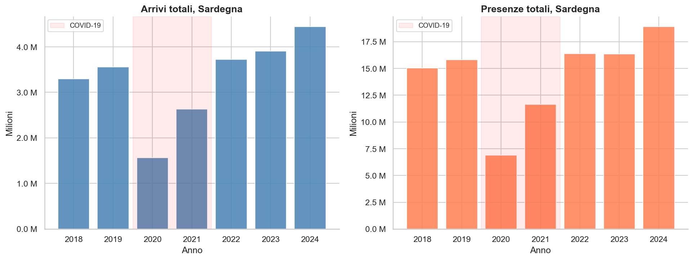

Il turismo sardo ha subito un **crollo di circa il 56% degli arrivi nel 2020** (passando da 3,56 a 1,56 
milioni) a causa della pandemia da COVID-19, seguito però da un forte rimbalzo nel
2021-2022. Nel 2023 la regione aveva infatti già superato i livelli del 2019 e nel 2024
lo scarto è salito al +25%.

**Fotografia 2024 per provincia:**

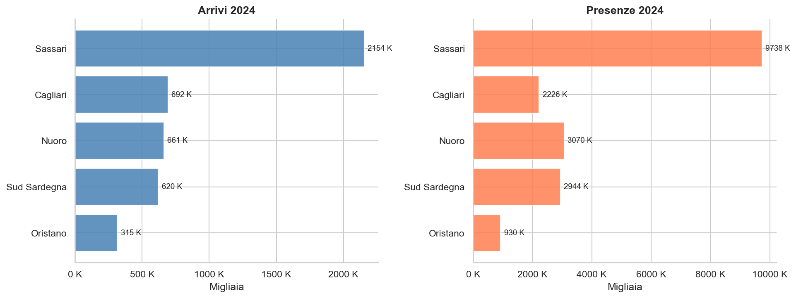

| Provincia | Arrivi 2024 | Presenze 2024 | Soggiorno medio (notti) |
|-----------|-------------|---------------|-------------------------|
| Sassari | 2,15 M | 9,74 M | 4,5 |
| Cagliari | 0,69 M | 2,23 M | 3,2 |
| Nuoro | 0,66 M | 3,07 M | 4,6 |
| Sud Sardegna | 0,62 M | 2,94 M | 4,7 |
| Oristano | 0,31 M | 0,93 M | 3,0 |

Sassari domina entrambe le metriche. Da notare che Cagliari è seconda per arrivi ma solo quarta per presenze: 
il soggiorno medio nel capoluogo è tra i più corti dell'isola (3,2 notti, solo Oristano scende a 3,0), lontano
dalle 4,5-4,7 di Sassari, Nuoro e Sud Sardegna: un profilo da city break più che da vacanza stanziale.

**Traiettorie provinciali:**

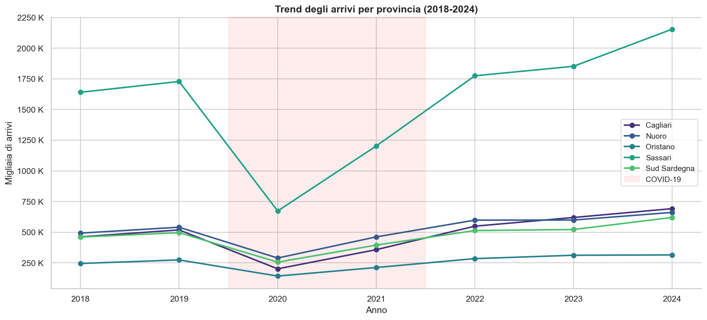

Sassari ha guidato la ripresa: con 2,15 milioni di arrivi nel 2024 vale quasi metà del mercato regionale e, con 
circa **+426.000 arrivi sul 2019 (+25%)**, quasi metà dell'intero incremento post-pandemia, trainata dalla forte 
crescita dell'extra-alberghiero e da un'elevata domanda internazionale. 
Oristano invece ha mostrato la ripresa più debole e i volumi assoluti più bassi lungo tutto il periodo.

---

## 3. Gap domanda-offerta

### Occupancy proxy: fotografia 2024

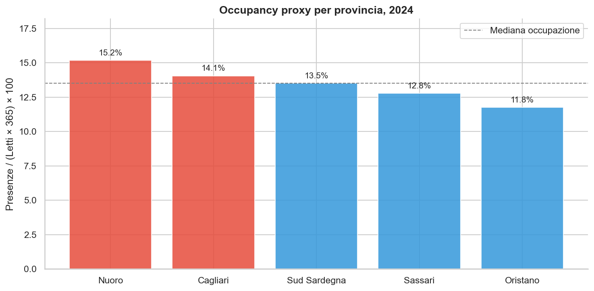

L'utilizzo annuo dei posti letto resta lontano dalla saturazione in tutte le province, conseguenza diretta della 
compressione estiva della domanda (Sez. 4). La pressione relativa è però ben differenziata, e il confronto con 
lo stock di posti letto rivela strutture di mercato molto diverse:

| Provincia | Occupancy proxy 2024 | Notti annue per letto | Posti letto | Lettura |
|-----------|----------------------|----------------------------|-------------|---------|
| Nuoro | **15,2%** | 55                         | 55.397 | Vincolo relativo più stretto: espansione giustificata |
| Cagliari | **14,1%** | 51                         | 43.381 | Stock più piccolo tra le grandi: pressione in area urbana |
| Sud Sardegna | **13,5%** | 49                         | 59.644 | Vicina alla media: monitorare il trend |
| Sassari | **12,8%** | 47                         | 208.779 | Volumi enormi diluiti su uno stock molto ampio |
| Oristano | **11,8%** | 43                         | 21.642 | Margine inutilizzato: prima serve attivare la domanda |

### Trend dell'occupazione nel tempo

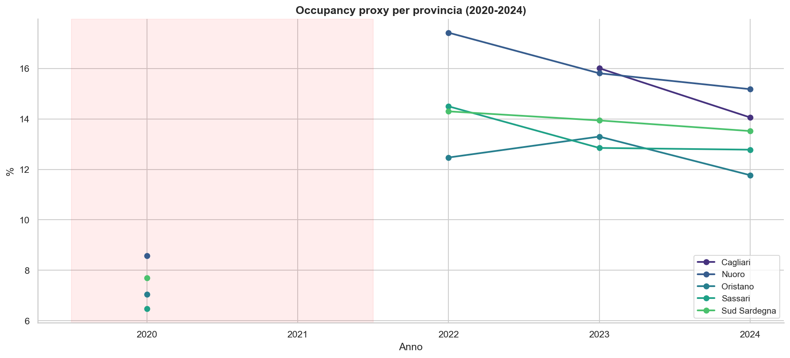

La serie confrontabile parte dal 2020 (v. Avvertenze in Appendice: la capacità 2018-2019 ha granularità mensile e 
il 2021 è privo del dettaglio provinciale). Il pattern è comune a tutte le province: forte risalita dal minimo 
pandemico al **picco del 2022**, poi una lieve flessione nel 2023-2024. 
La domanda è tornata prima, ma negli ultimi due anni **l'offerta è cresciuta più in fretta della domanda**: un segnale
che il mercato sta già rispondendo, e che la finestra per posizionarsi nelle province sotto pressione non resterà 
aperta a lungo.

---

## 4. Stagionalità

### Concentrazione mensile

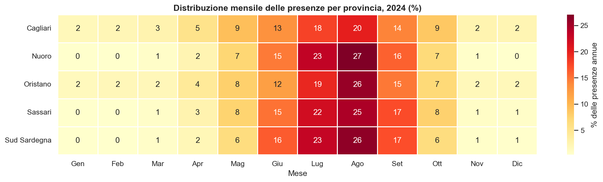

In tutte le province il turismo è dominato da una **finestra estiva ristretta**: i tre mesi di punta valgono infatti 
dal 52% al 66% delle presenze annue. La heatmap mostra un'attività quasi nulla tra novembre e febbraio nella maggior 
parte delle province, in particolare Nuoro, Sassari e Sud Sardegna.

### Indice di stagionalità

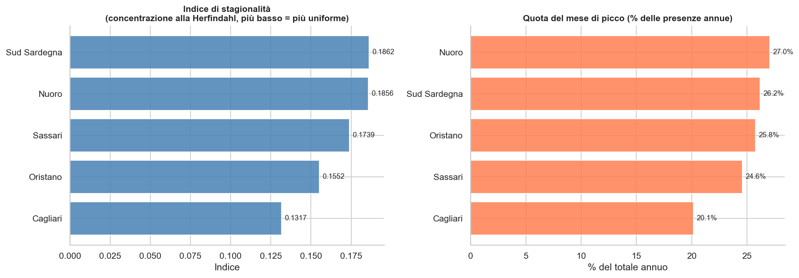

L'indice di stagionalità è calcolato come concentrazione alla Herfindahl delle quote mensili:

```
seasonality_index = Σ (month_share²)    su tutti i 12 mesi
```

Una distribuzione perfettamente uniforme sull'anno vale 0,0833 (1/12); una stagione interamente concentrata in un solo
mese vale 1,0. Valori più alti indicano un rischio stagionale maggiore.

Due esempi concreti dal 2024. A Cagliari il mese di picco vale il 20,1% delle presenze
e contribuisce all'indice per 0,201² ≈ 0,04: sommando i quadrati delle quote di tutti i
12 mesi si arriva a 0,132. A Nuoro il solo mese di picco (27,0%) pesa 0,270² ≈ 0,07 e
l'indice sale a 0,186: elevare al quadrato amplifica i mesi dominanti, quindi bastano
pochi mesi molto carichi per far salire l'indice in fretta.

| Provincia | Indice di stagionalità | Quota mese di picco | Quota top 3 mesi |
|-----------|------------------------|---------------------|------------------|
| Cagliari | **0,132** | **20,1%** | 52,2% |
| Oristano | 0,155 | 25,8% | 60,0% |
| Sassari | 0,174 | 24,6% | 63,8% |
| Nuoro | 0,186 | 27,0% | 66,5% |
| Sud Sardegna | 0,186 | 26,2% | 66,3% |

**Cagliari si distingue** come la provincia meno stagionale (indice 0,132, mese di picco al 20,1% delle presenze annue): 
la candidata più forte per strategie annuali come turismo congressuale, eventi culturali e pacchetti fuori stagione. 
Da notare che la seconda meno stagionale è Oristano: non per una destagionalizzazione riuscita, ma per una domanda 
debole anche nei mesi di punta. 
Lo stesso valore dell'indice racconta due storie opposte.

---

## 5. Segmentazione dei turisti

### Provenienza: italiani vs internazionali

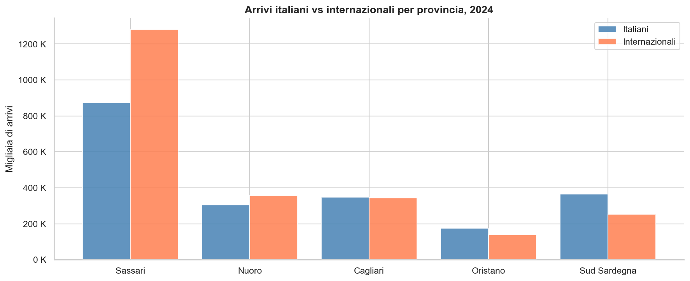

I turisti internazionali rappresentano un segmento consistente e strategicamente prezioso in tutte le province. 
Esprimono tipicamente una spesa per soggiorno più alta e una minore elasticità al prezzo rispetto ai turisti italiani.

| Provincia | Quota internazionale (2024) |
|-----------|------------------------------|
| Sassari | **59,5%**: la più diversificata a livello internazionale |
| Nuoro | 54,0% |
| Cagliari | 49,7% |
| Oristano | 44,4% |
| Sud Sardegna | **41,0%**: la più orientata al mercato domestico |

### Principali mercati di provenienza

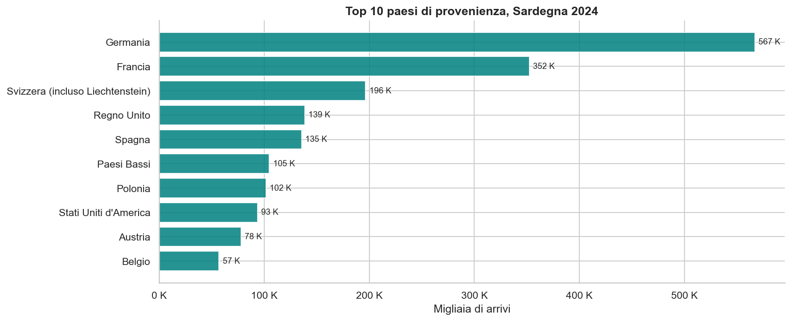

I mercati europei dominano gli arrivi internazionali. **Germania, Francia e Regno Unito** sono i primi tre paesi di 
provenienza, a conferma dell'importanza dei collegamenti con il Nord Europa (rotte aeree, traghetti) per l'economia 
turistica dell'isola.

---

## 6. Tendenze dell'offerta ricettiva

### Mix di mercato per provincia

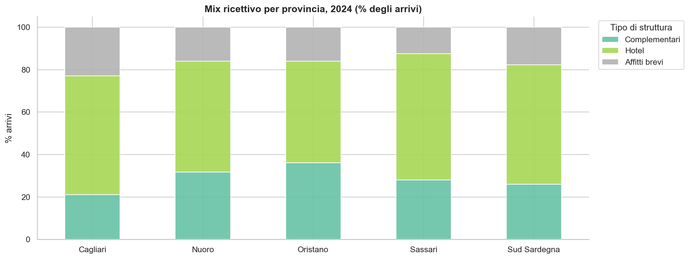

Gli affitti brevi (appartamenti privati, B&B, case vacanza) rappresentano ormai una quota significativa degli arrivi in 
ogni provincia. La loro traiettoria di crescita supera ampiamente quella degli hotel tradizionali.

### Durata media del soggiorno

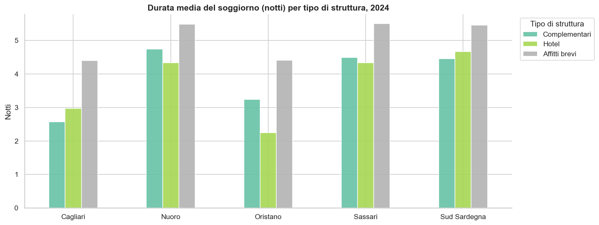

Gli ospiti degli affitti brevi soggiornano più a lungo degli ospiti degli hotel (4,4-5,5 notti contro 2,3-4,7), 
un pattern osservato in modo coerente in tutte le province. 
Segnala un profilo di turista qualitativamente diverso: viaggiatori in modalità vacanza piuttosto che ospiti di 
passaggio o business.

### Crescita anno su anno per segmento

| Provincia | Tipo di struttura | Crescita arrivi YoY (2023-2024) |
|-----------|-------------------|--------------------------------|
| Sassari | Affitti brevi | **+38,7%** |
| Nuoro | Affitti brevi | **+32,5%** |
| Sud Sardegna | Affitti brevi | **+31,1%** |
| Cagliari | Esercizi complementari | +28,1% |
| Oristano | Affitti brevi | +27,1% |
| Cagliari | Affitti brevi | +20,9% |
| Sud Sardegna | Hotel | +13,1% |
| Sassari | Hotel | +9,8% |
| Nuoro | Hotel | +3,5% |
| Cagliari | Hotel | +3,4% |
| Oristano | Hotel | **-6,3%** |

Il boom degli affitti brevi è un cambiamento strutturale dell'intero mercato: guidano la crescita in quattro province 
su cinque (a Cagliari il primo segmento è quello degli esercizi complementari). Gli hotel crescono tra il +3% e il +13%; 
la contrazione degli hotel a Oristano (-6,3%) riflette la combinazione di domanda debole e spiazzamento
competitivo da parte di formati ricettivi più flessibili.

---

## 7. Priorità di espansione

### Modello del punteggio di priorità

Per riuscire a ordinare le province in base all'attrattività ai fini di una possibile espansione si è calcolato un **punteggio
composito di priorità**, formato da tre componenti a pesi uguali, ciascuna normalizzata min-max nell'intervallo [0, 1]:

| Componente | Proxy di | Peso |
|------------|----------|------|
| Occupancy proxy | Vincolo attuale dell'offerta | 1/3 |
| Crescita arrivi YoY | Slancio del mercato | 1/3 |
| Quota internazionale | Potenziale del segmento premium | 1/3 |

```
priority_score = mean(occupancy_norm, yoy_growth_norm, intl_share_norm)
```

In parole semplici: il punteggio è la media di occupazione, crescita e quota
internazionale, ciascuna normalizzata min-max: su ogni leva la provincia peggiore vale
0, la migliore vale 1, le altre si collocano in proporzione.

Esempio con Cagliari (2024): l'occupancy proxy del 14,1% diventa 0,67 (tra il minimo
11,8% di Oristano e il massimo 15,2% di Nuoro), la crescita del +11,6% diventa 0,60 e
la quota internazionale del 49,7% diventa 0,47. Il punteggio è la media dei tre valori:
(0,67 + 0,60 + 0,47) / 3 ≈ 0,58, lo stesso che compare in classifica.

### Classifica delle province

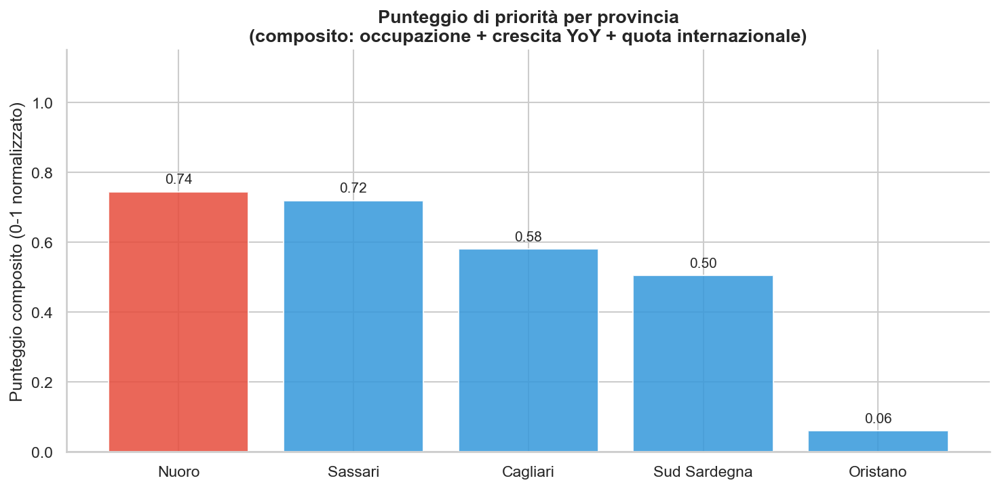

| Posizione | Provincia | Punteggio | Occupancy proxy | Crescita YoY | Quota intl |
|-----------|-----------|-----------|-----------------|--------------|------------|
| 1 | **Nuoro** | 0,74 | 15,2% (max) | +10,4% | 54,0% |
| 2 | **Sassari** | 0,72 | 12,8% | +16,3% | 59,5% (max) |
| 3 | Cagliari | 0,58 | 14,1% | +11,6% | 49,7% |
| 4 | Sud Sardegna | 0,50 | 13,5% | +18,8% (max) | 41,0% (min) |
| 5 | Oristano | 0,06 | 11,8% (min) | +0,9% (min) | 44,4% |

Nessuna provincia primeggia su tutte e tre le componenti: 
- Nuoro vince sulla pressione dell'offerta con un solido profilo internazionale
- Sassari unisce la quota internazionale più alta a una crescita robusta
- Sud Sardegna ha la crescita complessiva più rapida dell'isola (+18,8%), ma il punteggio è frenato dalla quota 
internazionale più bassa
- Oristano è ultima o quasi su ogni componente.

### Segmenti a maggiore crescita

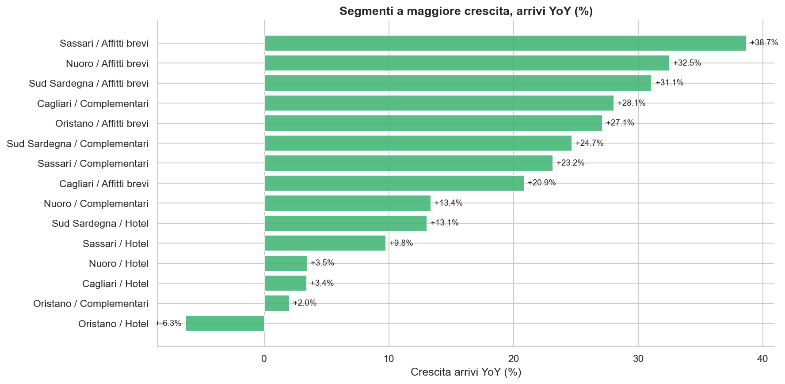

### Mappa di posizionamento strategico

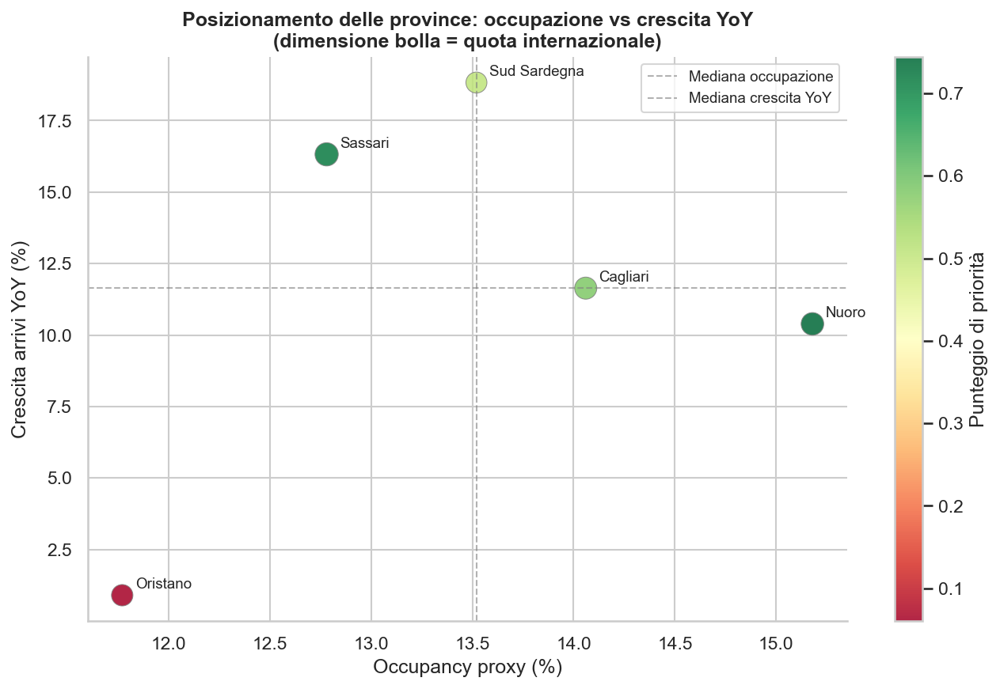

Il bubble chart colloca ogni provincia su una griglia bidimensionale: 
- **pressione sull'occupazione** (asse x) 
- **slancio di crescita** (asse y)

*La dimensione della bolla è proporzionale alla quota internazionale.*

Dal grafico emerge quindi che:

- Il **quadrante in alto a destra è vuoto**: nessuna provincia unisce oggi pressione massima e crescita massima. 
È il quadrante da presidiare, perché chi vi entrerà per primo (Nuoro se la crescita accelera, Sassari o Sud Sardegna se 
la pressione sale) diventerà il caso di espansione più urgente.
- **Nuoro** ha la pressione più alta ma una crescita sotto la mediana.
- **Sassari** e **Sud Sardegna** guidano la crescita partendo da una pressione intermedia.
- **Cagliari** si colloca vicino alle mediane: posizione equilibrata, adatta a un'espansione costante e misurata.
- **Oristano** cade nel quadrante in basso a sinistra: lo stimolo della domanda deve precedere l'investimento in offerta.

---

## 8. Raccomandazioni

### Nuoro: priorità alta

Nuoro mostra la pressione relativa sull'offerta più alta dell'isola (55 notti annualmente vendute per posto letto, su 
uno stock contenuto di ~55.000 letti) e una forte domanda internazionale (54%). Gli affitti brevi crescono del +32,5% YoY.

- **Espandere la capacità ricettiva**, in particolare nei formati extra-alberghieri (agriturismi, boutique rental) 
allineati al posizionamento su natura e cultura.
- **Puntare sui segmenti internazionali premium**: mercati quali Germania, Svizzera e Austria, con esperienze di 
trekking, cicloturismo e cultura locale autentica.
- **Investire in infrastrutture** (accessibilità, trasporto locale) per ridurre le frizioni che i visitatori 
internazionali possono incontrare in arrivo dai gateway di Cagliari e Olbia.

### Sassari: priorità alta

Sassari guida la crescita dei segmenti con gli affitti brevi (+38,7%), ha la quota internazionale più alta (59,5%) e da 
sola vale quasi metà del mercato regionale.

- **Capitalizzare lo slancio**: accelerare l'infrastruttura degli affitti brevi e semplificare i processi autorizzativi 
per far emergere l'offerta.
- **Rafforzare il marketing internazionale** su Germania, Francia e Regno Unito: i tre mercati di provenienza più 
coinvolti.
- **Sviluppare offerte di mezza stagione** (eventi culturali in primavera, enogastronomia in autunno) per ridurre la 
dipendenza dal picco estivo.

### Cagliari: priorità medio-alta

Cagliari combina una pressione sull'offerta sopra la mediana (14,1%, con lo stock di letti più piccolo tra le grandi 
province) con la **stagionalità più bassa** dell'isola e il soggiorno medio più corto: la piattaforma migliore per 
strategie annuali.

- **Investire in infrastrutture congressuali e MICE** (Meetings, Incentives, Conferences, Events) per attrarre viaggi 
business fuori dalla stagione estiva.
- **Espandere l'offerta di boutique hotel e strutture di design** per intercettare il segmento in crescita dei city 
break dalle città europee.
- **Sfruttare l'indice di stagionalità più basso** per negoziare con le compagnie aeree il mantenimento delle rotte 
tutto l'anno, riducendo il crollo invernale dei voli.

### Sud Sardegna: priorità media

Sud Sardegna ha la crescita complessiva più rapida dell'isola (+18,8% YoY) ma una base turistica sbilanciata sul 
mercato domestico (41% internazionale) e una pressione intermedia (13,5%).

- **Migliorare la visibilità internazionale**: marketing mirato in Francia e Germania per il turismo balneare, coerente 
con la geografia costiera della provincia.
- **Monitorare il tetto di occupazione**: se il ritmo di crescita attuale continua, i vincoli di offerta emergeranno 
prima qui che altrove.
- **Investire in infrastrutture costiere sostenibili** per proteggere l'attrattività di lungo periodo della destinazione 
per il segmento internazionale premium: i turisti esteri con spesa per soggiorno più alta e minore sensibilità 
al prezzo (v. Sez. 5).

### Oristano: priorità bassa (fase di attivazione della domanda)

Con l'utilizzo dei letti più basso dell'isola (11,8%), una crescita quasi nulla (+0,9%) e gli hotel in contrazione 
(-6,3% YoY), Oristano dovrebbe concentrarsi sullo **stimolare la domanda prima di aggiungere offerta**.

- **Attivare il turismo di nicchia**: l'ecosistema lagunare (Stagno di Cabras), l'archeologia (Tharros) e il 
birdwatching nelle zone umide sono asset differenzianti poco valorizzati dal marketing.
- **Collaborare con i tour operator** per creare itinerari curati che combinino Oristano con le province a maggior 
traffico (gite giornaliere da Cagliari, circuiti di più giorni con Nuoro).
- **Rinviare gli investimenti ricettivi su larga scala** finché le metriche di domanda (arrivi, occupazione) non 
convergano stabilmente verso i livelli delle altre province (13-14% di occupancy proxy).

---

## 9. Dashboard interattiva

È possibile esplorare interattivamente gli indicatori chiave su Looker Studio (vista live,
filtrabile per anno e provincia, alimentata dalla stessa pipeline di questo report):

[Apri la dashboard Looker Studio](https://lookerstudio.google.com/s/v2XX9XVY8Zk)

La dashboard riflette i dati 2018-2024 e verrà riallineata a ogni aggiornamento della
pipeline: il prossimo, con l'annata 2025, è previsto per l'autunno 2026.

---

## Appendice

### Fonti dati

| Fonte | URL |
|-------|-----|
| Osservatorio del Turismo, Regione Sardegna: open data (fonte ISTAT) | [osservatorio.sardegnaturismo.it](https://osservatorio.sardegnaturismo.it/it/open-data) |
| ISTAT: Movimento clienti e Capacità ricettiva (fonte statistica) | [dati.istat.it](https://dati.istat.it) |

### Definizioni dei campi

| Campo | Definizione |
|-------|-------------|
| `arrivals` | Numero di ospiti che effettuano il check-in nelle strutture nel periodo di riferimento |
| `nights` | Presenze totali (notti per ospite) nel periodo di riferimento |
| `occupancy_proxy` | `(total_nights / (total_beds × 365)) × 100` |
| `seasonality_index` | Concentrazione alla Herfindahl delle 12 quote mensili di presenze: `Σ(month_share²)` |
| `priority_score` | Media a pesi uguali di occupazione, crescita YoY e quota internazionale, normalizzate min-max |

Campi verificati sugli output della pipeline: nelle tabelle aggregate e nei CSV
esportati, `arrivals` e `nights` compaiono nelle forme aggregate `total_arrivals` e
`total_nights`.

### Avvertenze

- L'**occupancy proxy** è una stima per difetto dell'occupazione in alta stagione: assume che tutti i letti siano 
disponibili 365 giorni l'anno. Equivalenza utile: 1% di occupancy proxy = 3,65 notti annue vendute per posto letto.


- La **serie storica dell'occupancy** copre di fatto il 2020 e il 2022-2024: la capacità 2018-2019 è pubblicata a 
granularità mensile (non confrontabile, punto tracciato nel backlog tecnico), i dati di capacità 2021 sono privi del 
dettaglio provinciale nella fonte, e per Cagliari il dato è disponibile solo dal 2023.


- **Cambio di schema 2022-2023:** la fonte ha rimosso il campo `origin_macro` dai dati sui flussi turistici; la 
segmentazione italiani/internazionali è ricostruita a partire dal dettaglio per paese.


- **Perimetro provinciale:** l'analisi copre le cinque province sarde attuali. La provincia del Sud Sardegna è nata nel 
2016 dalla fusione di parti di Cagliari e Carbonia-Iglesias; i dati storici precedenti al 2018 non sono quindi 
direttamente confrontabili.

### Output dell'analisi

Generati in locale dalla pipeline sotto `data/analysis/` (gitignored):

| File | Descrizione                                                                       |
|------|-----------------------------------------------------------------------------------|
| `v_supply_demand_gap.csv` | Domanda e offerta unite per provincia e anno, con occupancy proxy                 |
| `q_priority_score.csv` | Province ordinate per punteggio composito, con le tre componenti descritte        |
| `q_seasonality_extremes.csv` | Indice di stagionalità, quota mese di picco e top 3 mesi per provincia            |
| `q_top_growth_segments.csv` | Segmenti provincia × tipo struttura, ordinati per crescita YoY                    |
| `v_segment_origin_summary.csv` | Ripartizione italiani/internazionali per provincia e anno (alimenta la dashboard) |

### Provenienza dei grafici

Tutti i grafici di questo report sono generati dal notebook
[`notebooks/01_eda_demand_supply.ipynb`](../../notebooks/01_eda_demand_supply.ipynb),
nelle due versioni EN (`reports/figures/`) e IT (`reports/figures/it/`). Le istruzioni
per rieseguire pipeline e notebook sono nel [README](../../it/README.md), sezione
Riproducibilità.
